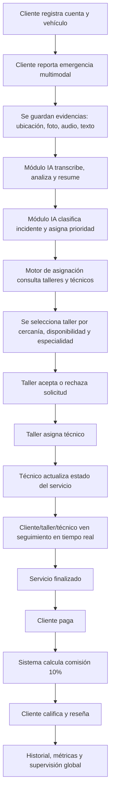
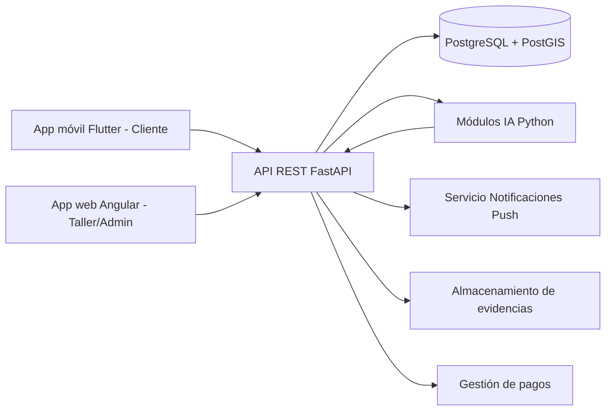
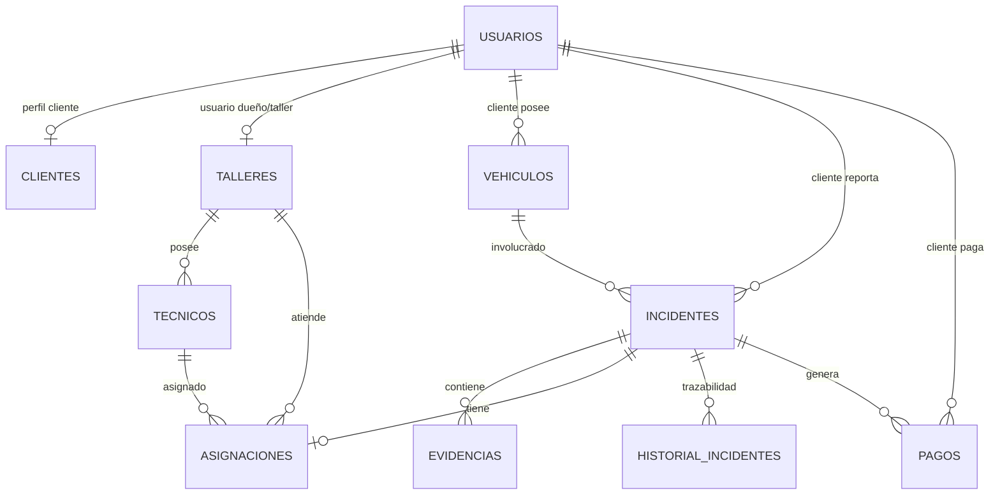

# Plataforma Inteligente de Atención de Emergencias Vehiculares - Documento optimizado para IA

> **Objetivo de este Markdown:** convertir el PDF original en una fuente de contexto más eficiente para IA. Este archivo prioriza estructura, trazabilidad, requisitos, decisiones, entidades, flujos, pruebas y observaciones técnicas. Al final se conserva una transcripción por páginas para trazabilidad textual.

## 1. Resumen ejecutivo para IA

El proyecto propone una **plataforma inteligente de atención de emergencias vehiculares** que conecta conductores con talleres mecánicos. El sistema permite reportar emergencias mediante **datos multimodales**: ubicación, fotos, audio y texto. Luego, módulos de IA procesan esta información para generar un diagnóstico preliminar, clasificar el incidente, asignar prioridad y apoyar la asignación del taller más adecuado.

La solución se compone de:

- **Aplicación móvil para clientes/conductores:** registro, vehículos, reporte de emergencia, seguimiento, notificaciones, pago y reseña.
- **Aplicación web para talleres:** registro de taller/técnicos, gestión de solicitudes, aceptación/rechazo, asignación de técnico, actualización de estados, historial.
- **Backend API REST:** desarrollado con **Python + FastAPI**.
- **Base de datos:** **PostgreSQL** con `pgcrypto` para UUIDs y `postgis` para datos geográficos.
- **Módulos IA:** transcripción de audio, análisis básico de imágenes, clasificación de incidentes, priorización y generación de resumen.
- **Seguimiento en tiempo real:** estados, ETA, ubicación del técnico y notificaciones push.
- **Modelo económico:** comisión del **10%** para la plataforma sobre el precio cobrado por el taller.

## 2. Ficha rápida del sistema

| Campo | Detalle |
|---|---|
| Nombre | Plataforma Inteligente de Atención de Emergencias Vehiculares |
| Dominio | Asistencia vehicular, emergencias, talleres mecánicos, geolocalización, IA multimodal |
| Metodología | PUDS / Proceso Unificado de Desarrollo de Software, iterativo e incremental |
| Modelado | UML: casos de uso, paquetes, comunicación, clases, despliegue, secuencia |
| Arquitectura | Cliente-servidor + API REST |
| Backend | Python + FastAPI |
| Web | Angular |
| Móvil | Flutter |
| Base de datos | PostgreSQL + PostGIS |
| IA | Audio a texto, clasificación, imagen, prioridad, resumen |
| Realtime | Seguimiento y notificaciones push |
| Repositorio | `https://github.com/DiegoMelgar61/Plataforma-Inteligente-de-Atenci-n-de-Emergencias-Vehiculares` |
| Web | `https://plataforma-inteligente-de-atenci-n.vercel.app/login` |

## 3. Problema que resuelve

Los conductores enfrentan incidentes como fallas mecánicas, pinchazos, problemas de batería, sobrecalentamiento, accidentes leves, pérdida de llaves o llaves dentro del vehículo. El proceso tradicional para conseguir ayuda es lento y poco confiable porque depende de llamadas, información poco clara, tiempos de respuesta impredecibles, dificultad para identificar al proveedor adecuado y ausencia de trazabilidad.

Los talleres también tienen problemas: no reciben solicitudes de forma organizada, no pueden evaluar rápidamente la naturaleza del incidente, no priorizan casos con criterios claros y no optimizan recursos técnicos en tiempo real.

La plataforma resuelve esto centralizando el flujo completo: **reporte -> análisis IA -> priorización -> asignación -> atención -> seguimiento -> pago -> reseña -> métricas**.

## 4. Objetivo general

Desarrollar una plataforma inteligente de atención de emergencias vehiculares que permita conectar usuarios con talleres mecánicos mediante análisis automatizado de incidentes usando imagen, audio, texto y geolocalización, optimizando diagnóstico preliminar, priorización y asignación del servicio.

## 5. Objetivos específicos

- Diseñar una arquitectura basada en servicios con soporte para procesamiento en tiempo real.
- Implementar una aplicación móvil para clientes.
- Diseñar una aplicación web para talleres.
- Integrar geolocalización para ubicar incidentes y proveedores.
- Incorporar IA para transcripción de audio, clasificación de incidentes y análisis básico de imágenes.
- Diseñar sistema de priorización de emergencias.
- Implementar asignación inteligente de talleres.
- Gestionar notificaciones push.
- Mantener trazabilidad completa de cada incidente.

## 6. Alcance funcional

### 6.1 Aplicación móvil cliente

- Registro de cliente.
- Registro de uno o más vehículos.
- Registro de emergencia con:
  - ubicación en tiempo real,
  - fotos del vehículo/incidente,
  - audio describiendo el problema,
  - texto adicional opcional.
- Visualización de estado de solicitud.
- Visualización del taller asignado.
- Visualización del tiempo estimado de llegada.
- Recepción de notificaciones push.
- Comunicación con taller.
- Pago del servicio.
- Calificación y reseña.

### 6.2 Aplicación web talleres

- Registro de taller.
- Registro de técnicos asociados.
- Gestión de disponibilidad.
- Visualización de solicitudes disponibles.
- Visualización de información estructurada enriquecida por IA.
- Aceptación o rechazo de solicitudes.
- Asignación de técnicos.
- Actualización del estado del servicio.
- Historial de atenciones.
- Consulta de resumen IA, clasificación y prioridad.

## 7. Actores del sistema

| Actor | Rol | Funciones clave |
| --- | --- | --- |
| Cliente / Conductor | Usuario final que solicita auxilio mecánico | Registro, registro de vehículos, reporte de emergencia con ubicación/fotos/audio, seguimiento, pagos, calificación |
| Dueño del Taller | Responsable operativo del taller | Registro del taller/técnicos, visualización de solicitudes IA, aceptación/rechazo, asignación operativa |
| Técnico Mecánico | Operador que presta asistencia física | Recibe orden, actualiza estado, comparte ubicación para ETA |
| Módulo IA | Procesa datos multimodales | Transcribe audio, analiza imágenes, clasifica incidentes, prioriza, genera resumen |
| Administrador del Sistema | Gestión global y mantenimiento | Autenticación/autorización, perfiles, integridad de datos, monitoreo de asignación y notificaciones |

## 8. Casos de uso - resumen ejecutivo

| ID | Caso de uso | Ciclo | Prioridad | Riesgo | Actor principal/clave |
| --- | --- | --- | --- | --- | --- |
| CU1 | Gestionar Inicio/Cierre de sesión | C1 | Crítica | Alto | Cliente / Administrador / Taller |
| CU2 | Gestionar Roles y Permisos | C1 | Crítica | Alto | Administrador |
| CU3 | Registrar Cliente y Vehículo | C1 | Importante | Medio | Cliente |
| CU4 | Registrar Taller y Técnicos | C1 | Importante | Medio | Dueño del Taller / Administrador |
| CU5 | Registrar Emergencia Multimodal | C2 | Crítica | Alto | Cliente |
| CU6 | Clasificación y Priorización | C2 | Crítica | Alto | Módulo IA |
| CU7 | Asignación Inteligente a Taller | C2 | Crítica | Alto | Sistema / Motor de Asignación |
| CU8 | Gestionar solicitud en taller | C2 | Crítica | Alto | Dueño del Taller / Técnico |
| CU9 | Seguimiento en Tiempo Real | C2 | Crítica | Alto | Cliente / Dueño del Taller / Técnico |
| CU10 | Notificaciones Push en Tiempo Real | C2 | Importante | Medio | Cliente / Dueño del Taller / Técnico |
| CU11 | Actualizar Estado de Servicio | C2 | Crítica | Medio | Técnico / Dueño del Taller |
| CU12 | Procesar Pago del Servicio | C3 | Crítica | Alto | Cliente / Sistema |
| CU13 | Calificar y Reseñar Servicio | C3 | Importante | Medio | Cliente |
| CU14 | Consultar Historial y Métricas | C3 | Importante | Baja | Cliente / Dueño del Taller / Administrador |
| CU15 | Supervisar Operaciones Globales | C3 | Importante | Medio | Administrador |

## 9. Casos de uso - detalle operativo para IA

### CU1. Gestionar Inicio/Cierre de sesión

- **Propósito:** Autenticación y cierre seguro de sesión.
- **Actores:** Cliente / Administrador / Taller.
- **Precondición:** Usuario registrado.
- **Flujo principal:** Ingreso de credenciales; validación en BD; acceso según rol; cierre de sesión.
- **Postcondición:** Usuario autenticado o sesión finalizada.
- **Excepción:** Credenciales incorrectas o usuario no registrado.
- **Ciclo/Prioridad/Riesgo:** C1 / Crítica / Alto.

### CU2. Gestionar Roles y Permisos

- **Propósito:** Administrar accesos y privilegios.
- **Actores:** Administrador.
- **Precondición:** Administrador autenticado.
- **Flujo principal:** Crear roles; asignar permisos; modificar permisos; asignar roles a usuarios.
- **Postcondición:** Roles y permisos actualizados.
- **Excepción:** Permisos inválidos o conflicto de roles.
- **Ciclo/Prioridad/Riesgo:** C1 / Crítica / Alto.

### CU3. Registrar Cliente y Vehículo

- **Propósito:** Registrar cliente y asociar uno o más vehículos.
- **Actores:** Cliente.
- **Precondición:** Ninguna.
- **Flujo principal:** Ingreso de datos personales; creación de cuenta; registro de vehículo; almacenamiento en BD.
- **Postcondición:** Cliente y vehículo registrados.
- **Excepción:** Datos incompletos o vehículo ya registrado.
- **Ciclo/Prioridad/Riesgo:** C1 / Importante / Medio.

### CU4. Registrar Taller y Técnicos

- **Propósito:** Registrar talleres mecánicos y técnicos asociados.
- **Actores:** Dueño del Taller / Administrador.
- **Precondición:** Usuario autenticado como administrador.
- **Flujo principal:** Registro de datos del taller; registro de técnicos; asociación técnico-taller; almacenamiento en BD.
- **Postcondición:** Taller y técnicos registrados.
- **Excepción:** Datos inválidos o duplicación.
- **Ciclo/Prioridad/Riesgo:** C1 / Importante / Medio.

### CU5. Registrar Emergencia Multimodal

- **Propósito:** Reportar emergencia con ubicación, imágenes, audio y texto.
- **Actores:** Cliente.
- **Precondición:** Cliente autenticado y con vehículo registrado.
- **Flujo principal:** Seleccionar registrar emergencia; enviar ubicación; adjuntar imágenes; ingresar texto; registrar solicitud; confirmar envío.
- **Postcondición:** Emergencia registrada con evidencias.
- **Excepción:** Datos incompletos, error de archivos o pérdida de conexión.
- **Ciclo/Prioridad/Riesgo:** C2 / Crítica / Alto.

### CU6. Clasificación y Priorización

- **Propósito:** Clasificar incidente y asignar nivel de prioridad.
- **Actores:** Módulo IA.
- **Precondición:** Incidente procesado con información estructurada.
- **Flujo principal:** Recibir datos; identificar problema; evaluar severidad; asignar prioridad; generar ficha estructurada; enviar a asignación.
- **Postcondición:** Incidente clasificado y priorizado.
- **Excepción:** Información ambigua o error en modelo IA.
- **Ciclo/Prioridad/Riesgo:** C2 / Crítica / Alto.

### CU7. Asignación Inteligente a Taller

- **Propósito:** Seleccionar taller adecuado por ubicación, disponibilidad, tipo y prioridad.
- **Actores:** Sistema / Motor de Asignación.
- **Precondición:** Incidente registrado, clasificado y priorizado.
- **Flujo principal:** Recibir incidente; consultar talleres; evaluar cercanía; validar capacidad/disponibilidad; comparar candidatos; seleccionar taller; registrar asignación.
- **Postcondición:** Taller asignado al incidente.
- **Excepción:** Sin talleres disponibles o falla de asignación.
- **Ciclo/Prioridad/Riesgo:** C2 / Crítica / Alto.

### CU8. Gestionar solicitud en taller

- **Propósito:** Aceptar/rechazar solicitudes, asignar técnicos y gestionar avance.
- **Actores:** Dueño del Taller / Técnico.
- **Precondición:** Solicitud registrada, procesada y asignada a taller.
- **Flujo principal:** Visualizar solicitudes; revisar ficha; aceptar/rechazar; actualizar estado; registrar avance; finalizar solicitud.
- **Postcondición:** Solicitud gestionada con estado actualizado.
- **Excepción:** No hay técnicos, rechazo o error del sistema.
- **Ciclo/Prioridad/Riesgo:** C2 / Crítica / Alto.

### CU9. Seguimiento en Tiempo Real

- **Propósito:** Monitorear estado, avance, taller, técnico y ETA.
- **Actores:** Cliente / Dueño del Taller / Técnico.
- **Precondición:** Solicitud aceptada y técnico asignado.
- **Flujo principal:** Consultar estado; ver taller; ver técnico; monitorear progreso; consultar ETA; actualizar información; confirmar atención finalizada.
- **Postcondición:** Información actualizada para actores.
- **Excepción:** Sin asignación activa, error realtime o pérdida de conexión.
- **Ciclo/Prioridad/Riesgo:** C2 / Crítica / Alto.

### CU10. Notificaciones Push en Tiempo Real

- **Propósito:** Notificar eventos relevantes de asignación, estado, atención y cierre.
- **Actores:** Cliente / Dueño del Taller / Técnico.
- **Precondición:** Solicitud registrada y eventos relevantes generados.
- **Flujo principal:** Detectar evento; generar mensaje; identificar destinatario; enviar push; recibir mensaje; visualizar alerta.
- **Postcondición:** Notificación enviada/recibida.
- **Excepción:** Falla servicio push, dispositivo no disponible o error de entrega.
- **Ciclo/Prioridad/Riesgo:** C2 / Importante / Medio.

### CU11. Actualizar Estado de Servicio

- **Propósito:** Actualizar estado del incidente asegurando trazabilidad.
- **Actores:** Técnico / Dueño del Taller.
- **Precondición:** Solicitud aceptada y servicio en ejecución.
- **Flujo principal:** Acceder solicitud; seleccionar nuevo estado; registrar cambio; actualizar historial; sincronizar seguimiento/notificaciones; confirmar.
- **Postcondición:** Estado actualizado y reflejado.
- **Excepción:** Estado inválido, error al guardar o pérdida de conexión.
- **Ciclo/Prioridad/Riesgo:** C2 / Crítica / Medio.

### CU12. Procesar Pago del Servicio

- **Propósito:** Registrar y procesar pago y comisión de plataforma.
- **Actores:** Cliente / Sistema.
- **Precondición:** Servicio finalizado y monto generado.
- **Flujo principal:** Acceder a pago; visualizar monto; seleccionar método; validar transacción; registrar pago; generar comprobante.
- **Postcondición:** Pago registrado y servicio pagado.
- **Excepción:** Pago rechazado, datos inválidos o error validación.
- **Ciclo/Prioridad/Riesgo:** C3 / Crítica / Alto.

### CU13. Calificar y Reseñar Servicio

- **Propósito:** Evaluar servicio mediante calificación y comentario.
- **Actores:** Cliente.
- **Precondición:** Servicio finalizado y asociado al cliente.
- **Flujo principal:** Acceder calificación; seleccionar puntuación; registrar comentario; validar; almacenar; confirmar.
- **Postcondición:** Calificación y reseña registradas.
- **Excepción:** Calificación fuera de rango, comentario inválido o servicio no finalizado.
- **Ciclo/Prioridad/Riesgo:** C3 / Importante / Medio.

### CU14. Consultar Historial y Métricas

- **Propósito:** Consultar incidentes, servicios, pagos y métricas operativas.
- **Actores:** Cliente / Dueño del Taller / Administrador.
- **Precondición:** Usuario autenticado con permisos.
- **Flujo principal:** Acceder historial; seleccionar filtros; consultar incidentes; consultar pagos/estados/asignaciones; generar métricas; visualizar.
- **Postcondición:** Historial y métricas visualizadas.
- **Excepción:** Sin registros, filtros inválidos o sin permisos.
- **Ciclo/Prioridad/Riesgo:** C3 / Importante / Baja.

### CU15. Supervisar Operaciones Globales

- **Propósito:** Monitorear usuarios, talleres, incidentes, pagos, métricas y estado del sistema.
- **Actores:** Administrador.
- **Precondición:** Administrador autenticado.
- **Flujo principal:** Acceder panel; consultar usuarios/talleres; supervisar incidentes; revisar pagos; visualizar métricas; detectar incidencias.
- **Postcondición:** Operaciones supervisadas.
- **Excepción:** Sin permisos, error al cargar datos o indisponibilidad.
- **Ciclo/Prioridad/Riesgo:** C3 / Importante / Medio.


## 10. Ciclos de desarrollo PUDS

### Ciclo 1 - Base del sistema

Incluye autenticación, autorización y registro base:

- CU1 Gestionar Inicio/Cierre de sesión.
- CU2 Gestionar Roles y Permisos.
- CU3 Registrar Cliente y Vehículo.
- CU4 Registrar Taller y Técnicos.

### Ciclo 2 - Núcleo operativo e inteligente

Incluye reporte de emergencia, IA, asignación, seguimiento y estados:

- CU5 Registrar Emergencia Multimodal.
- CU6 Clasificación y Priorización.
- CU7 Asignación Inteligente a Taller.
- CU8 Gestionar solicitud en taller.
- CU9 Seguimiento en tiempo real.
- CU10 Notificaciones Push en Tiempo Real.
- CU11 Actualizar Estado del Servicio.

### Ciclo 3 - Cierre, métricas y control

Incluye monetización, evaluación, historial y supervisión:

- CU12 Procesar Pago del Servicio.
- CU13 Calificar y Reseñar Servicio.
- CU14 Consultar Historial y Métricas.
- CU15 Supervisar Operaciones Globales.

## 11. Flujo principal del negocio



## 12. Arquitectura conceptual



## 13. Paquetes de análisis

| Paquete | Nombre | Responsabilidad | Casos de uso relacionados |
| --- | --- | --- | --- |
| P1 | Seguridad y Administración | Autenticación, autorización, roles, permisos y control administrativo | CU1, CU2, CU15 |
| P2 | Gestión de usuarios, vehículos y talleres | Registro y administración de clientes, vehículos, talleres y técnicos | CU3, CU4 |
| P3 | Gestión de Emergencias Inteligente | Registro de incidentes y procesamiento multimodal con IA | CU5, CU6, CU7 |
| P4 | Atención y Seguimiento del Servicio | Gestión de solicitudes, asignación operativa, seguimiento realtime, notificaciones y actualización de estados | CU8, CU9, CU10, CU11 |
| P5 | Evaluación, Historial y Pagos | Pagos, comisión, historial, métricas, calificaciones y reseñas | CU12, CU13, CU14 |

## 14. Responsabilidades por paquete

### P1. Seguridad y Administración

Gestiona autenticación, autorización, roles, permisos y supervisión administrativa. Debe controlar acceso por perfil y proteger operaciones críticas.

### P2. Gestión de Usuario, Taller y Técnico

Gestiona información base para operación: usuarios, clientes, vehículos, talleres y técnicos. Esta información alimenta los flujos de emergencia y asignación.

### P3. Gestión de Emergencias Inteligente

Registra incidentes, almacena evidencias y ejecuta procesamiento IA. Genera clasificación, prioridad y resumen estructurado.

### P4. Atención y Seguimiento del Servicio

Administra solicitudes, aceptación/rechazo, asignación de técnico, estados, seguimiento en tiempo real y notificaciones.

### P5. Evaluación, Historial y Pagos

Controla pagos, comisión, calificaciones, reseñas, historial y métricas operativas.

## 15. Diseño de datos - modelo resumido

### 15.1 Extensiones PostgreSQL

- `pgcrypto`: generación de UUIDs con `gen_random_uuid()`.
- `postgis`: manejo de datos geográficos `geography(Point, 4326)` para ubicación de incidentes y técnicos.

### 15.2 Enumeraciones definidas

- **clasificacion_enum:** `BATERIA, LLANTA, CHOQUE, MOTOR, OTROS, INCIERTO`
- **estado_incidente_enum:** `PENDIENTE, EN_PROCESO_IA, CLASIFICADO, ASIGNADO, EN_CAMINO, EN_PROCESO, ATENDIDO, CANCELADO, INCIERTO`
- **estado_pago_enum:** `PENDIENTE, PAGADO, RECHAZADO`
- **prioridad_enum:** `BAJA, MEDIA, ALTA`
- **rol_enum:** `CLIENTE, TALLER, ADMIN`
- **tipo_evidencia_enum:** `IMAGEN, AUDIO, TEXTO`

### 15.3 Tablas principales

| Tabla | Propósito | Campos/relaciones relevantes |
| --- | --- | --- |
| usuarios | Cuenta base del sistema | id_usuario PK UUID; correo único; hash_contrasena; nombre; teléfono; rol; activo; timestamps; eliminación lógica |
| clientes | Perfil cliente especializado | id_usuario PK/FK -> usuarios; relación 1:1 |
| talleres | Proveedor de asistencia | id_taller PK; id_usuario único opcional; nombre_negocio; nit único; dirección; tasa_comision default 10%; activo; timestamps |
| tecnicos | Personal del taller | id_tecnico PK; id_taller FK; nombre; teléfono; disponible; ubicacion_actual geography(Point,4326); timestamps |
| vehiculos | Vehículos del cliente | id_vehiculo PK; id_usuario_cliente FK -> usuarios; marca; modelo; anio; placa única; timestamps |
| incidentes | Emergencia vehicular reportada | id_incidente PK; cliente FK; vehículo FK; ubicación geography; estado; prioridad; clasificación; resumen_ia; ETA; timestamps |
| pagos | Pago y comisión | id_pago PK; incidente FK; cliente FK; monto; comision_plataforma; estado; metodo_pago; id_transaccion; fecha |
| asignaciones | Taller/técnico asignado a incidente | id_asignacion PK; id_incidente único; id_taller FK; id_tecnico FK; fechas de asignación/aceptación/rechazo; motivo_rechazo |
| evidencias | Multimedia/texto del incidente | id_evidencia PK; id_incidente FK; tipo; url_archivo; clave_archivo; texto_transcrito; fecha |
| historial_incidentes | Trazabilidad de cambios de estado | id_historial PK; id_incidente FK; estado; notas; id_usuario_cambio FK; fecha_cambio |

### 15.4 Relaciones clave



## 16. SQL físico extraído del documento

> Nota: esta sección conserva el contenido SQL y tablas de volumen extraídas de las páginas 53 a 66. Existen inconsistencias detectadas en el análisis técnico: el DDL principal usa esquema `public`, UUIDs y enums, mientras que el procedimiento y trigger posteriores usan esquema `exa1`, IDs enteros y tablas no definidas dentro del mismo diseño físico.

```sql
-- [Página 53]
Normalización
El sistema de información ya se encuentra en 1ra, 2da, 3ra y 4ta forma normal.
Diagrama Relacional

Diseño Físico
CREATE EXTENSION IF NOT EXISTS pgcrypto;
CREATE EXTENSION IF NOT EXISTS postgis;

-- =========================
-- ENUMS
-- =========================

-- [Página 54]
CREATE TYPE public."clasificacion_enum" AS ENUM (
    'BATERIA',
    'LLANTA',
    'CHOQUE',
    'MOTOR',
    'OTROS',
    'INCIERTO'
);

CREATE TYPE public."estado_incidente_enum" AS ENUM (
    'PENDIENTE',
    'EN_PROCESO_IA',
    'CLASIFICADO',
    'ASIGNADO',
    'EN_CAMINO',
    'EN_PROCESO',
    'ATENDIDO',
    'CANCELADO',
    'INCIERTO'
);

CREATE TYPE public."estado_pago_enum" AS ENUM (
    'PENDIENTE',
    'PAGADO',
    'RECHAZADO'
);

CREATE TYPE public."prioridad_enum" AS ENUM (
    'BAJA',
    'MEDIA',
    'ALTA'
);

CREATE TYPE public."rol_enum" AS ENUM (
    'CLIENTE',
    'TALLER',
    'ADMIN'
);

CREATE TYPE public."tipo_evidencia_enum" AS ENUM (
    'IMAGEN',
    'AUDIO',
    'TEXTO'
);

-- =========================
-- TABLAS
-- =========================

-- [Página 55]
CREATE TABLE public.usuarios (
    id_usuario uuid DEFAULT gen_random_uuid() NOT NULL,
    correo_electronico varchar(255) NOT NULL,
    hash_contrasena text NOT NULL,
    nombre_completo varchar(255) NOT NULL,
    telefono varchar(20) NULL,
    rol public."rol_enum" NOT NULL,
    activo bool DEFAULT true NULL,
    fecha_creacion timestamptz DEFAULT now() NULL,
    fecha_actualizacion timestamptz DEFAULT now() NULL,
    fecha_eliminacion timestamptz NULL,
    CONSTRAINT usuarios_correo_electronico_key UNIQUE
(correo_electronico),
    CONSTRAINT usuarios_pkey PRIMARY KEY (id_usuario)
);

CREATE TABLE public.clientes (
    id_usuario uuid NOT NULL,
    CONSTRAINT clientes_pkey PRIMARY KEY (id_usuario),
    CONSTRAINT clientes_id_usuario_fkey
        FOREIGN KEY (id_usuario)
        REFERENCES public.usuarios(id_usuario)
        ON DELETE CASCADE
);

CREATE TABLE public.talleres (
    id_taller uuid DEFAULT gen_random_uuid() NOT NULL,
    id_usuario uuid NULL,
    nombre_negocio varchar(255) NOT NULL,
    nit varchar(50) NULL,
    direccion text NULL,
    tasa_comision numeric(5, 2) DEFAULT 10.00 NULL,
    activo bool DEFAULT true NULL,
    fecha_creacion timestamptz DEFAULT now() NULL,
    fecha_actualizacion timestamptz DEFAULT now() NULL,
    CONSTRAINT talleres_id_usuario_key UNIQUE (id_usuario),
    CONSTRAINT talleres_nit_key UNIQUE (nit),
    CONSTRAINT talleres_pkey PRIMARY KEY (id_taller),
    CONSTRAINT talleres_id_usuario_fkey
        FOREIGN KEY (id_usuario)
        REFERENCES public.usuarios(id_usuario)
        ON DELETE CASCADE
);

CREATE TABLE public.tecnicos (
    id_tecnico uuid DEFAULT gen_random_uuid() NOT NULL,
    id_taller uuid NOT NULL,
    nombre_completo varchar(255) NOT NULL,

-- [Página 56]
telefono varchar(20) NULL,
    disponible bool DEFAULT true NULL,
    ubicacion_actual geography(point, 4326) NULL,
    fecha_creacion timestamptz DEFAULT now() NULL,
    fecha_actualizacion timestamptz DEFAULT now() NULL,
    CONSTRAINT tecnicos_pkey PRIMARY KEY (id_tecnico),
    CONSTRAINT tecnicos_id_taller_fkey
        FOREIGN KEY (id_taller)
        REFERENCES public.talleres(id_taller)
        ON DELETE CASCADE
);

CREATE TABLE public.vehiculos (
    id_vehiculo uuid DEFAULT gen_random_uuid() NOT NULL,
    id_usuario_cliente uuid NOT NULL,
    marca varchar(100) NULL,
    modelo varchar(100) NULL,
    anio int4 NULL,
    placa varchar(20) NULL,
    fecha_creacion timestamptz DEFAULT now() NULL,
    fecha_actualizacion timestamptz DEFAULT now() NULL,
    CONSTRAINT vehiculos_pkey PRIMARY KEY (id_vehiculo),
    CONSTRAINT vehiculos_placa_key UNIQUE (placa),
    CONSTRAINT vehiculos_id_usuario_cliente_fkey
        FOREIGN KEY (id_usuario_cliente)
        REFERENCES public.usuarios(id_usuario)
        ON DELETE CASCADE
);

CREATE TABLE public.incidentes (
    id_incidente uuid DEFAULT gen_random_uuid() NOT NULL,
    id_usuario_cliente uuid NOT NULL,
    id_vehiculo uuid NULL,
    ubicacion geography(point, 4326) NOT NULL,
    estado public."estado_incidente_enum" DEFAULT 'PENDIENTE'
NOT NULL,
    prioridad public."prioridad_enum" DEFAULT 'MEDIA' NOT NULL,
    clasificacion public."clasificacion_enum" DEFAULT 'OTROS'
NOT NULL,
    resumen_ia text NULL,
    tiempo_estimado_llegada_minutos int4 NULL,
    fecha_creacion timestamptz DEFAULT now() NULL,
    fecha_actualizacion timestamptz DEFAULT now() NULL,
    CONSTRAINT incidentes_pkey PRIMARY KEY (id_incidente),
    CONSTRAINT incidentes_id_usuario_cliente_fkey
        FOREIGN KEY (id_usuario_cliente)
        REFERENCES public.usuarios(id_usuario),
    CONSTRAINT incidentes_id_vehiculo_fkey
        FOREIGN KEY (id_vehiculo)

-- [Página 57]
REFERENCES public.vehiculos(id_vehiculo)
);

CREATE TABLE public.pagos (
    id_pago uuid DEFAULT gen_random_uuid() NOT NULL,
    id_incidente uuid NULL,
    id_usuario_cliente uuid NULL,
    monto numeric(10, 2) NOT NULL,
    comision_plataforma numeric(10, 2) NOT NULL,
    estado public."estado_pago_enum" DEFAULT 'PENDIENTE' NULL,
    metodo_pago varchar(50) NULL,
    id_transaccion varchar(255) NULL,
    fecha_creacion timestamptz DEFAULT now() NULL,
    CONSTRAINT pagos_pkey PRIMARY KEY (id_pago),
    CONSTRAINT pagos_id_incidente_fkey
        FOREIGN KEY (id_incidente)
        REFERENCES public.incidentes(id_incidente),
    CONSTRAINT pagos_id_usuario_cliente_fkey
        FOREIGN KEY (id_usuario_cliente)
        REFERENCES public.usuarios(id_usuario)
);

CREATE TABLE public.asignaciones (
    id_asignacion uuid DEFAULT gen_random_uuid() NOT NULL,
    id_incidente uuid NULL,
    id_taller uuid NULL,
    id_tecnico uuid NULL,
    fecha_asignacion timestamptz DEFAULT now() NULL,
    fecha_aceptacion timestamptz NULL,
    fecha_rechazo timestamptz NULL,
    motivo_rechazo text NULL,
    CONSTRAINT asignaciones_id_incidente_key UNIQUE
(id_incidente),
    CONSTRAINT asignaciones_pkey PRIMARY KEY (id_asignacion),
    CONSTRAINT asignaciones_id_incidente_fkey
        FOREIGN KEY (id_incidente)
        REFERENCES public.incidentes(id_incidente),
    CONSTRAINT asignaciones_id_taller_fkey
        FOREIGN KEY (id_taller)
        REFERENCES public.talleres(id_taller),
    CONSTRAINT asignaciones_id_tecnico_fkey
        FOREIGN KEY (id_tecnico)
        REFERENCES public.tecnicos(id_tecnico)
);

CREATE TABLE public.evidencias (
    id_evidencia uuid DEFAULT gen_random_uuid() NOT NULL,
    id_incidente uuid NOT NULL,
    tipo public."tipo_evidencia_enum" NOT NULL,

-- [Página 58]
url_archivo text NOT NULL,
    clave_archivo text NULL,
    texto_transcrito text NULL,
    fecha_creacion timestamptz DEFAULT now() NULL,
    CONSTRAINT evidencias_pkey PRIMARY KEY (id_evidencia),
    CONSTRAINT evidencias_id_incidente_fkey
        FOREIGN KEY (id_incidente)
        REFERENCES public.incidentes(id_incidente)
        ON DELETE CASCADE
);

CREATE TABLE public.historial_incidentes (
    id_historial uuid DEFAULT gen_random_uuid() NOT NULL,
    id_incidente uuid NOT NULL,
    estado public."estado_incidente_enum" NOT NULL,
    notas text NULL,
    id_usuario_cambio uuid NULL,
    fecha_cambio timestamptz DEFAULT now() NULL,
    CONSTRAINT historial_incidentes_pkey PRIMARY KEY
(id_historial),
    CONSTRAINT historial_incidentes_id_incidente_fkey
        FOREIGN KEY (id_incidente)
        REFERENCES public.incidentes(id_incidente)
        ON DELETE CASCADE,
    CONSTRAINT historial_incidentes_id_usuario_cambio_fkey
        FOREIGN KEY (id_usuario_cambio)
        REFERENCES public.usuarios(id_usuario)
);

Tablas de Volumen
1. Usuarios
Atributo
Tipo de Dato
Descripción
Tamaño
Nulo
Llave
id_usuario
UUID
Identificador
único del
usuario
16 bytes
No
Primaria
correo_electronico
VARCHAR(255)
Correo
electrónico
del usuario
Variable
No
Única
hash_contrasena
TEXT
Contraseña
cifrada del
usuario
Variable
No

nombre_completo
VARCHAR(255)
Nombre
completo del
usuario
Variable
No

-- [Página 59]
telefono
VARCHAR(20)
Número
telefónico
del usuario
Variable
Sí

rol
ENUM
(rol_enum)
Rol del
usuario:
CLIENTE,
TALLER o
ADMIN
Variable
No

activo
BOOLEAN
Indica si la
cuenta está
activa
1 byte
Sí

fecha_creacion
TIMESTAMPTZ
Fecha de
creación del
registro
8 bytes
Sí

fecha_actualizacion
TIMESTAMPTZ
Fecha de
actualización
del registro
8 bytes
Sí

fecha_eliminacion
TIMESTAMPTZ
Fecha de
eliminación
lógica
8 bytes
Sí

2. Clientes
Atributo
Tipo de
Dato
Descripción
Tamaño
Nulo
Llave
id_usuario
UUID
Identificador
del usuario
que es
cliente
16 bytes
No
Primaria /
Foránea

3. Talleres
Atributo
Tipo de Dato
Descripción
Tamaño
Nulo
Llave
id_taller
UUID
Identificador
único del
taller
16 bytes
No
Primaria
id_usuario
UUID
Usuario
asociado al
taller
16 bytes
Sí
Foránea /
Única
nombre_negocio
VARCHAR(255)
Nombre
comercial
del taller
Variable
No

nit
VARCHAR(50)
NIT del taller Variable
Sí
Única

-- [Página 60]
direccion
TEXT
Dirección
del taller
Variable
Sí

tasa_comision
NUMERIC(5,2)
Comisión
que cobra la
plataforma
Variable
Sí

activo
BOOLEAN
Estado
activo del
taller
1 byte
Sí

fecha_creacion
TIMESTAMPTZ
Fecha de
creación del
registro
8 bytes
Sí

fecha_actualizacion
TIMESTAMPTZ
Fecha de
actualización
del registro
8 bytes
Sí

4. Técnicos
Atributo
Tipo de Dato
Descripción Tamaño Nulo
Llave
id_tecnico
UUID
Identificador
único del
técnico
16 bytes No
Primaria
id_taller
UUID
Taller al que
pertenece el
técnico
16 bytes No
Foránea
nombre_completo
VARCHAR(255)
Nombre
completo
del técnico
Variable No

telefono
VARCHAR(20)
Número de
teléfono del
técnico
Variable Sí

disponible
BOOLEAN
Indica si el
técnico está
disponible
1 byte
Sí

ubicacion_actual
GEOGRAPHY(Point,4326)
Ubicación
geográfica
actual del
técnico
Variable Sí

fecha_creacion
TIMESTAMPTZ
Fecha de
creación del
registro
8 bytes
Sí

-- [Página 61]
fecha_actualizacion TIMESTAMPTZ
Fecha de
actualización
del registro
8 bytes
Sí

5. Vehículos
Atributo
Tipo de Dato
Descripción
Tamaño
Nulo
Llave
id_vehiculo
UUID
Identificador
único del
vehículo
16 bytes
No
Primaria
id_usuario_cliente
UUID
Cliente
propietario del
vehículo
16 bytes
No
Foránea
marca
VARCHAR(100) Marca del
vehículo
Variable
Sí

modelo
VARCHAR(100) Modelo del
vehículo
Variable
Sí

anio
INT4
Año del
vehículo
4 bytes
Sí

placa
VARCHAR(20)
Placa del
vehículo
Variable
Sí
Única
fecha_creacion
TIMESTAMPTZ
Fecha de
creación del
registro
8 bytes
Sí

fecha_actualizacion
TIMESTAMPTZ
Fecha de
actualización
del registro
8 bytes
Sí

6. Incidentes
Atributo
Tipo de Dato
Descripción Tamaño Nulo
Llave
id_incidente
UUID
Identificador
único del
incidente
16
bytes
No
Primaria
id_usuario_cliente
UUID
Cliente que
reportó el
incidente
16
bytes
No
Foránea
id_vehiculo
UUID
Vehículo
involucrado
en el
incidente
16
bytes
Sí
Foránea

-- [Página 62]
ubicacion
GEOGRAPHY(Point,4326)
Ubicación
geográfica
del incidente
Variable No

estado
ENUM
(estado_incidente_enum)
Estado
actual del
incidente
Variable No

prioridad
ENUM (prioridad_enum)
Nivel de
prioridad del
incidente
Variable No

clasificacion
ENUM
(clasificacion_enum)
Clasificación
del tipo de
incidente
Variable No

resumen_ia
TEXT
Resumen
generado
por
inteligencia
artificial
Variable Sí

tiempo_estimado_llegada_minutos INT4
Tiempo
estimado de
llegada del
apoyo
técnico
4 bytes
Sí

fecha_creacion
TIMESTAMPTZ
Fecha de
creación del
incidente
8 bytes
Sí

fecha_actualizacion
TIMESTAMPTZ
Fecha de
actualización
del incidente
8 bytes
Sí

7. Pagos
Atributo
Tipo de Dato
Descripción
Tamaño
Nulo
Llave
id_pago
UUID
Identificador
único del
pago
16 bytes
No
Primaria
id_incidente
UUID
Incidente
asociado al
pago
16 bytes
Sí
Foránea

-- [Página 63]
id_usuario_cliente
UUID
Cliente que
realiza el pago 16 bytes
Sí
Foránea
monto
NUMERIC(10,2)
Monto total
pagado
Variable
No

comision_plataforma NUMERIC(10,2)
Comisión
retenida por
la plataforma
Variable
No

estado
ENUM
(estado_pago_enum)
Estado del
pago
Variable
Sí

metodo_pago
VARCHAR(50)
Método
utilizado para
pagar
Variable
Sí

id_transaccion
VARCHAR(255)
Código o
identificador
de la
transacción
Variable
Sí

fecha_creacion
TIMESTAMPTZ
Fecha de
creación del
pago
8 bytes
Sí

8. Asignaciones
Atributo
Tipo de Dato
Descripción
Tamaño
Nulo
Llave
id_asignacion
UUID
Identificador
único de la
asignación
16 bytes
No
Primaria
id_incidente
UUID
Incidente
asignado
16 bytes
Sí
Foránea /
Única
id_taller
UUID
Taller
responsable de
atender el
incidente
16 bytes
Sí
Foránea
id_tecnico
UUID
Técnico
asignado al
incidente
16 bytes
Sí
Foránea
fecha_asignacion
TIMESTAMPTZ
Fecha en que
se realizó la
asignación
8 bytes
Sí

-- [Página 64]
fecha_aceptacion TIMESTAMPTZ
Fecha en que
se aceptó la
asignación
8 bytes
Sí

fecha_rechazo
TIMESTAMPTZ
Fecha en que
se rechazó la
asignación
8 bytes
Sí

motivo_rechazo
TEXT
Motivo del
rechazo de la
asignación
Variable
Sí

9. Evidencias
Atributo
Tipo de Dato
Descripción
Tamaño
Nulo
Llave
id_evidencia
UUID
Identificador
único de la
evidencia
16 bytes
No
Primaria
id_incidente
UUID
Incidente al que
pertenece la
evidencia
16 bytes
No
Foránea
tipo
ENUM
(tipo_evidencia_enum)
Tipo de
evidencia:
imagen, audio o
texto
Variable
No

url_archivo
TEXT
Ruta o URL del
archivo
almacenado
Variable
No

clave_archivo
TEXT
Clave o
referencia
interna del
archivo
Variable
Sí

texto_transcrito
TEXT
Texto extraído o
transcrito desde
la evidencia
Variable
Sí

-- [Página 65]
fecha_creacion
TIMESTAMPTZ
Fecha de
creación del
registro
8 bytes
Sí

10. Historial_Incidentes
Atributo
Tipo de Dato
Descripción
Tamaño
Nulo
Llave
id_historial
UUID
Identificador
único del
historial
16 bytes No
Primaria
id_incidente
UUID
Incidente
relacionado
16 bytes No
Foránea
estado
ENUM
(estado_incidente_enum)
Estado
registrado en
el historial
Variable No

notas
TEXT
Observaciones
o comentarios
del cambio
Variable Sí

id_usuario_cambio UUID
Usuario que
realizó el
cambio
16 bytes Sí
Foránea
fecha_cambio
TIMESTAMPTZ
Fecha en que
se registró el
cambio
8 bytes
Sí

Procedimiento de Almacenados
CREATE OR REPLACE PROCEDURE exa1.sp_actualizar_estado_incidente(
    p_nro_incidente INT,
    p_nuevo_estado INT
)
LANGUAGE plpgsql
AS $$
BEGIN
    -- 1. Actualizar el estado en la tabla principal
    UPDATE exa1.incidente
    SET id_estado = p_nuevo_estado
    WHERE nro_incidente = p_nro_incidente;

    -- 2. Insertar el registro histórico en la tabla de seguimiento
    INSERT INTO exa1.seguimiento (nro_incidente, id_estado, fecha_modif)
    VALUES (p_nro_incidente, p_nuevo_estado, CURRENT_TIMESTAMP);

-- [Página 66]
-- 3. Regla de Negocio: Si el estado es 5 (Resuelto), registrar la hora
de fin
    IF p_nuevo_estado = 5 THEN
        UPDATE exa1.incidente
        SET fecha_hora_auxilio = CURRENT_TIMESTAMP
        WHERE nro_incidente = p_nro_incidente;
    END IF;

    -- Confirmar la transacción
    COMMIT;
END;
$$;

Disparadores (Triggers)
-- 1. Primero creamos la función que contiene la lógica
CREATE OR REPLACE FUNCTION exa1.fn_notificar_cambio_estado()
RETURNS TRIGGER AS $$
DECLARE
    v_nombre_estado TEXT;
BEGIN
    -- Validamos si el estado realmente cambió (para no notificar si solo
actualizaron otro campo)
    IF NEW.id_estado IS DISTINCT FROM OLD.id_estado THEN

        -- Obtenemos el nombre del nuevo estado en texto
        SELECT nombre INTO v_nombre_estado
        FROM exa1.estado
        WHERE id_estado = NEW.id_estado;

        -- Insertamos la alerta automática para el cliente dueño del
incidente
        INSERT INTO exa1.notificacion (id_usuario, titulo, mensaje,
fecha_envio)
        VALUES (
            NEW.id_usuario,
            'Actualización de tu Emergencia',
            'Tu auxilio (Nro. ' || NEW.nro_incidente || ') ha cambiado al
estado: ' || v_nombre_estado,
            CURRENT_TIMESTAMP
        );
    END IF;

    RETURN NEW;
END;
$$ LANGUAGE plpgsql;

-- 2. Creamos el Trigger que "dispara" la función anterior
CREATE TRIGGER trg_notificar_cambio_estado
AFTER UPDATE ON exa1.incidente
FOR EACH ROW
EXECUTE FUNCTION exa1.fn_notificar_cambio_estado();
```

## 17. Diseño de interfaz y diagramas visuales del PDF

El PDF contiene prototipos y diagramas visuales. Para uso con IA, se recomienda tratarlos así:

- **Páginas 23-30:** prototipos e imágenes de interfaz para login, registro de cuenta, registro de cliente/vehículo y registro de taller/técnicos; además, diagramas de casos de uso CU1-CU15.
- **Páginas 31-32:** estructuración de modelos de casos de uso por ciclo.
- **Páginas 33-37:** paquetes, relación de paquetes con casos de uso y vista de paquetes.
- **Páginas 38-40:** diagramas de comunicación para CU1-CU15.
- **Páginas 41-48:** análisis de clases por ciclo y casos de uso.
- **Páginas 49-50:** diseño de arquitectura física/lógica.
- **Páginas 51-52:** diagrama de clases y mapeo.
- **Páginas 67-74:** diagramas de secuencia por caso de uso.
- **Páginas 77-78:** arquitectura del sistema/subsistemas por paquetes.

Para una IA, la información funcional más importante de esos diagramas ya está representada en las secciones de actores, casos de uso, paquetes, flujo principal y diseño de datos.

## 18. Implementación propuesta

### Backend

- Lenguaje: Python.
- Framework: FastAPI.
- Exposición de servicios: API REST.
- Validación de datos: tipado y modelos compatibles con FastAPI/Pydantic.
- Persistencia: PostgreSQL mediante ORM como SQLAlchemy.
- Módulos IA en Python para procesamiento multimodal.

### Frontend web

- Framework: Angular.
- Uso: aplicación web para talleres y administradores.
- Enfoque: componentes reutilizables, paneles de gestión, solicitudes, técnicos, historial y métricas.

### Frontend móvil

- Framework: Flutter.
- Uso: app cliente/conductor.
- Funciones principales: registro, reporte multimodal, ubicación, seguimiento, notificaciones, pago y reseña.

### Base de datos

- PostgreSQL como SGBD principal.
- PostGIS para ubicaciones geográficas.
- Integridad referencial con claves foráneas.
- Uso de enums para estados, prioridad, clasificación, rol y tipo de evidencia.

### Despliegue y herramientas

- Railway mencionado para despliegue portable/desacoplado.
- Vercel aparece en el enlace web del proyecto.
- GitHub centraliza código fuente, control de versiones, colaboración, revisión de código, issues e integración continua.

### Sistemas operativos

El sistema se plantea como compatible con Windows, macOS, Linux, Android e iOS por su enfoque web/móvil responsivo y multiplataforma.

## 19. Plan de pruebas

### 19.1 Objetivos de prueba

- Validar funcionalidad de los casos de uso.
- Verificar integridad entre móvil, web, backend, base de datos e IA.
- Asegurar usabilidad en móvil y web.
- Validar procesamiento inteligente: transcripción, clasificación, análisis de imagen y resumen.
- Detectar defectos antes de despliegue final.

### 19.2 Estrategia de pruebas

| Tipo | Descripción | Enfoque |
|---|---|---|
| Unidad | Verificar componentes individuales | Caja blanca; backend y BD |
| Integración | Comprobar comunicación entre paquetes | Flujo completo por CU |
| Validación | Verificar requisitos desde perspectiva del usuario | Caja negra |
| Aceptación | Obtener aprobación del cliente/usuario clave | Simulación de uso real en ambiente de prueba |

### 19.3 Casos de prueba resumidos

| Caso prueba | CU | Nombre | Actor | Objetivo | Resultado esperado |
| --- | --- | --- | --- | --- | --- |
| CP-CU1-01 | CU1 | Validación de Acceso y Generación de Token JWT | Usuario | Acceso a usuarios registrados y token con rol correcto | JSON success=True + token Bearer |
| CP-CU2-01 | CU2 | Restricción de Acceso Administrativo por Rol | Administrador | Solo id_role=1 accede a gestión de permisos | 403 para no autorizados; admin permitido |
| CP-CU3-01 | CU3 | Asociación de Vehículo a Perfil de Cliente | Cliente | Vehículo vinculado correctamente a user_id | Vehículo visible en perfil |
| CP-CU4-01 | CU4 | Alta de Taller con Ubicación Geográfica | Gerente de Taller | Dirección/ubicación para algoritmo de asignación | Taller activo en mapa |
| CP-CU5-01 | CU5 | Clasificación de Incidente mediante IA Multimodal | Cliente | Audio/foto/ubicación generan ficha estructurada | Ficha con diagnóstico preliminar |
| CP-CU6-01 | CU6 | Clasificación automática del incidente | Módulo IA | Clasificar incidente y asignar prioridad | Incidente clasificado y priorizado |
| CP-CU7-01 | CU7 | Asignación automática a taller disponible | Sistema | Asignar mejor taller por ubicación/disponibilidad/tipo | Incidente asociado a taller válido |
| CP-CU8-01 | CU8 | Aceptación y asignación de solicitud | Dueño del taller | Aceptar/rechazar solicitud y asignar técnico | Solicitud gestionada correctamente |
| CP-CU9-01 | CU9 | Consulta del estado actual del servicio | Cliente | Ver estado actualizado del servicio | Seguimiento muestra información actualizada |
| CP-CU10-01 | CU10 | Envío de notificación por cambio de estado | Sistema | Enviar notificación ante evento relevante | Notificación llega correctamente |
| CP-CU11-01 | CU11 | Actualización del estado del incidente | Técnico | Actualizar estado y registrar historial | Estado cambia con trazabilidad |
| CP-CU12-01 | CU12 | Registro de pago exitoso | Cliente | Registrar pago y comisión | Pago registrado como exitoso |
| CP-CU13-01 | CU13 | Registro de calificación del servicio | Cliente | Calificar y reseñar servicio finalizado | Reseña asociada al servicio |
| CP-CU14-01 | CU14 | Consulta de historial de incidentes | Administrador | Consultar historial e indicadores | Información filtrada correcta |
| CP-CU15-01 | CU15 | Supervisión general de la plataforma | Administrador | Monitorear usuarios, talleres, incidentes, pagos y métricas | Panel global actualizado |

## 20. Análisis técnico para IA

### 20.1 Fortalezas del documento

- El proyecto tiene un dominio claro y útil: atención de emergencias vehiculares.
- La propuesta integra web, móvil, backend, base de datos, IA, geolocalización y notificaciones.
- Los casos de uso cubren el flujo end-to-end: registro, emergencia, IA, asignación, atención, pago, reseña y métricas.
- La separación por ciclos PUDS permite priorizar una implementación incremental.
- El diseño de datos incluye entidades centrales coherentes: usuarios, clientes, talleres, técnicos, vehículos, incidentes, evidencias, asignaciones, pagos e historial.
- El uso de PostGIS es coherente con la necesidad de asignación por cercanía.
- La trazabilidad del incidente está considerada mediante estados, historial y notificaciones.

### 20.2 Inconsistencias y riesgos detectados

Estas observaciones son importantes para cualquier IA que deba mejorar, implementar o defender el proyecto:

1. **CU7 duplicado/mal rotulado en una tabla:** en la tabla de ciclos aparece CU7 como "Gestionar solicitud en taller", duplicando CU8. La versión correcta por lista general y detalle es **CU7: Asignación Inteligente a Taller**.
2. **Actor de CU7 inconsistente:** en algunos diagramas aparece como actor el Módulo IA, pero en la especificación el actor principal es el Sistema. Recomendación: modelar un **Motor de Asignación** o **Sistema** como actor interno, alimentado por IA.
3. **CU11 contiene error textual:** aparece "Técnico, del Taller nomas". Debe quedar como **Técnico / Dueño del Taller**.
4. **Pruebas mencionan objetos ajenos:** CU1 y CU2 mencionan `agroenlace.usuario`, `agroenlace.rol`, `id_role = 1` y CU3 menciona "CU21", que no pertenece al documento actual.
5. **DDL vs procedimiento/trigger:** el diseño físico usa `public.usuarios`, `public.incidentes`, UUIDs y enums; pero el procedimiento/trigger usan `exa1.incidente`, `exa1.seguimiento`, `exa1.estado`, `exa1.notificacion`, `nro_incidente`, `id_estado` enteros. Esto parece provenir de otro modelo anterior.
6. **Falta tabla de notificaciones:** CU10 requiere notificaciones push, pero el DDL no define una tabla `notificaciones` en el modelo principal.
7. **Falta tabla de calificaciones/reseñas:** CU13 requiere registrar calificación y comentario, pero no existe tabla `calificaciones` o `resenas` en el DDL principal.
8. **Roles y permisos incompletos:** CU2 habla de gestionar roles/permisos, pero el DDL solo usa `rol_enum`. Si se requiere administración flexible, faltan tablas `roles`, `permisos` y `rol_permiso`.
9. **Ubicación del taller:** la asignación por cercanía requiere ubicación geográfica del taller; el DDL de `talleres` solo tiene `direccion`, mientras que `tecnicos` sí tiene `ubicacion_actual`.
10. **Asignación única por incidente:** `asignaciones.id_incidente` es único. Esto simplifica, pero limita reintentos/historial de rechazos si un taller rechaza y se debe reasignar.
11. **Pagos no tienen detalle de servicio:** CU12 requiere monto del servicio y comisión, pero no aparece una tabla de cotización/tarifa/servicio final que explique cómo se genera el monto.
12. **Seguridad:** se menciona hash de contraseña y JWT, pero faltan reglas explícitas de expiración de tokens, refresh tokens, auditoría, recuperación de contraseña y protección de archivos multimedia.

### 20.3 Recomendaciones técnicas priorizadas

#### Alta prioridad

- Corregir inconsistencias de CU7, CU11 y referencias a `agroenlace`/`exa1`.
- Agregar tablas faltantes: `notificaciones`, `calificaciones`, posiblemente `roles`, `permisos`, `rol_permiso`.
- Agregar ubicación geográfica al taller o definir claramente que la asignación se hace por técnico disponible.
- Definir máquina de estados del incidente y transiciones válidas.
- Separar con claridad el módulo IA del motor de asignación.

#### Media prioridad

- Agregar tabla de auditoría/logs para acciones críticas.
- Agregar manejo de reintentos de asignación.
- Definir almacenamiento de archivos: bucket, clave, tipo MIME, tamaño, visibilidad y expiración.
- Normalizar cálculo de comisión del 10%.
- Mejorar pruebas para que usen nombres de tablas coherentes con el modelo actual.

#### Baja prioridad

- Mejorar bibliografía y referencias técnicas.
- Formalizar criterios no funcionales: disponibilidad, latencia, seguridad, escalabilidad, privacidad, retención de datos.
- Convertir diagramas a PlantUML/Mermaid para trazabilidad versionable.

## 21. Backlog técnico sugerido para una siguiente versión

| Prioridad | Ítem | Justificación |
|---|---|---|
| Alta | Crear tabla `notificaciones` | Requerida por CU10 y trigger |
| Alta | Crear tabla `calificaciones` | Requerida por CU13 |
| Alta | Corregir procedimiento y trigger a `public.incidentes` | Evitar mezcla de modelos `exa1` vs `public` |
| Alta | Definir motor de asignación | CU7 depende de criterios claros |
| Alta | Definir transición de estados | Evita estados inválidos |
| Media | Agregar ubicación a talleres | Mejora asignación por cercanía |
| Media | Agregar historial de asignaciones | Permite rechazos y reasignaciones |
| Media | Definir módulos FastAPI | Implementación más limpia |
| Media | Agregar pruebas de integración end-to-end | Valida flujo completo |
| Baja | Versionar diagramas en Mermaid/PlantUML | Mejor comprensión por IA y mantenimiento |

## 22. Prompt maestro para usar este documento con IA

```text
Actúa como arquitecto de software senior y AI Engineer.
Usa este Markdown como fuente de verdad del proyecto "Plataforma Inteligente de Atención de Emergencias Vehiculares".

Objetivo:
Analizar, mejorar, implementar o documentar el sistema sin inventar requisitos fuera del contexto.

Reglas:
1. Respeta los actores, casos de uso, ciclos PUDS, paquetes, entidades y flujos definidos.
2. Considera FastAPI, PostgreSQL/PostGIS, Angular, Flutter y módulos IA en Python como stack base.
3. Antes de proponer código, verifica coherencia con el modelo de datos y los casos de uso.
4. Si detectas contradicciones, sepáralas en una sección llamada "Inconsistencias detectadas".
5. No uses nombres de tablas antiguos como agroenlace o exa1 salvo que sea para explicar inconsistencias.
6. Para implementación nueva, usa el modelo principal con esquema public y tablas: usuarios, clientes, talleres, tecnicos, vehiculos, incidentes, pagos, asignaciones, evidencias, historial_incidentes.
7. Si necesitas agregar tablas faltantes, justifica su necesidad vinculándola al caso de uso correspondiente.
8. Entrega respuestas estructuradas, con criterios de aceptación y pasos verificables.
```

## 23. Conclusión sintetizada

El proyecto digitaliza la atención de emergencias vehiculares mediante una plataforma centralizada que integra clientes, talleres, técnicos y administradores. Su valor diferencial está en el uso de IA multimodal y geolocalización para reducir incertidumbre, mejorar diagnóstico preliminar, priorizar incidentes y asignar talleres de forma más eficiente. La arquitectura modular y el diseño por ciclos facilitan la escalabilidad y evolución del sistema, pero antes de implementar se recomienda corregir inconsistencias del modelo de datos, procedimientos, triggers y tablas faltantes.

## 24. Recomendaciones sintetizadas

- Capacitar clientes, talleres y técnicos.
- Optimizar continuamente modelos IA.
- Fortalecer seguridad: acceso, cifrado, respaldo y auditoría.
- Implementar monitoreo y mantenimiento continuo.
- Integrar servicios externos: geolocalización avanzada, pagos digitales y APIs de terceros.
- Medir desempeño: tiempos de respuesta, satisfacción, precisión IA y efectividad de asignación.

## 25. Bibliografía y enlaces fuente

### Bibliografía conceptual mencionada

- Booch, Rumbaugh & Jacobson - UML.
- Jacobson, Booch & Rumbaugh - Proceso Unificado de Desarrollo de Software.
- Sommerville - Ingeniería de Software.
- Russell & Norvig - Inteligencia Artificial.
- Documentación Angular.
- Documentación FastAPI.
- Documentación Flutter.
- Documentación PostgreSQL.
- Documentación Psycopg.

### Enlaces del proyecto

- Web: `https://plataforma-inteligente-de-atenci-n.vercel.app/login`
- Repositorio: `https://github.com/DiegoMelgar61/Plataforma-Inteligente-de-Atenci-n-de-Emergencias-Vehiculares`

---

# Anexo A - Transcripción textual por páginas

> Este anexo conserva el texto extraído del PDF para trazabilidad. Para usar con IA de manera eficiente, primero utiliza las secciones 1-24. Recurre a este anexo solo cuando necesites comprobar una frase, tabla o contenido específico del PDF.

### Página 1

```text
UNIVERSIDAD AUTÓNOMA GABRIEL RENÉ MORENO
FACULTAD DE INGENIERÍA EN CIENCIAS DE LA
COMPUTACIÓN Y TELECOMUNICACIONES

Plataforma Inteligente de Atención de Emergencias Vehiculares

Materia: Sistemas de Información II
Sigla: INF412
Docente: MSc. Ing. Angelica Garzon Cuellar
Grupo: 15
Integrantes:
•
Melgar Gushi Diego
•
Ortiz Montero Luis Enrique

Semestre I/2026
```

### Página 2

```text
Índice
1.
PERFIL ................................................................................................................................ 4
1.1.
INTRODUCCIÓN ....................................................................................................... 4
1.2 OBJETIVO GENERAL ................................................................................................... 4
1.3 OBJETIVOS ESPECÍFICOS .......................................................................................... 4
1.4 DESCRIPCIÓN DEL PROBLEMA ................................................................................ 5
1.5 ALCANCE ......................................................................................................................... 5
2.
MARCO TEÓRICO ........................................................................................................... 6
3.
FLUJO DE TRABAJO ....................................................................................................... 8
3.1 CAPTURA DE REQUISITOS ......................................................................................... 8
3.1.1 Encontrar Actores y Casos de Uso: .......................................................................... 8
3.1.2 PRIORIZAR CASOS DE USO ............................................................................... 10
3.1.3 DETALLAR CASOS DE USO ................................................................................ 12
CICLO #1 ............................................................................................................................ 12
CICLO #2 ............................................................................................................................ 16
CICLO #3 .............................................................................................................................. 21
3.1.4 PROTOTIPAR LA INTERFAZ DE USUARIO ................................................... 23
3.1.5 ESTRUCTURAR MODELOS DE CASOS DE USO............................................ 31
CICLO #1 ............................................................................................................................ 31
CICLO #2 ............................................................................................................................ 32
CICLO #3 ............................................................................................................................ 32
3.2 ANÁLISIS ........................................................................................................................ 33
3.2.1 ANÁLISIS DE ARQUITECTURA ......................................................................... 33
3.2.1.2 RELACIONAR PAQUETES Y CASOS DE USO ................................................. 34
3.2.1.3 VISTA DE PAQUETES ......................................................................................... 36
3.2.2 DIAGRAMA DE COMUNICACIÓN .................................................................... 38
3.2.3 ANALIZAR UNA CLASE ....................................................................................... 41
CICLO #1 ............................................................................................................................ 41
 CICLO #2 ........................................................................................................................... 42
CICLO #3 ............................................................................................................................ 46
3.2.4 ANALIZAR UN PAQUETE ................................................................................... 48
3.3 DISEÑO ........................................................................................................................... 49
3.3.1 DISEÑO DE ARQUITECTURA ................................................................................ 49
3.3.2 DISEÑO DE DATOS ................................................................................................... 51
3.3.2.1 Diseño de Datos Lógico ......................................................................................... 51
3.3.3 DISEÑO DE CASO DE USO ...................................................................................... 67
```

### Página 3

```text
3.4 IMPLEMENTACIÓN .................................................................................................... 75
3.4.1 Lenguaje de Programación...................................................................................... 75
3.4.2 Base de Datos ............................................................................................................ 75
3.4.3 Sistemas Operativos ................................................................................................. 76
3.4.4 Otros .......................................................................................................................... 76
3.4.5 Arquitectura del Sistema ......................................................................................... 77
3.4.6 Arquitectura del Subsistema ................................................................................... 78
3.5 PRUEBAS ........................................................................................................................ 79
3.5.1 Planificar Pruebas .................................................................................................... 79
3.5.2 Objetivos de la Prueba ............................................................................................. 79
3.5.3 Estrategia de Pruebas .............................................................................................. 80
3.5.6 Casos de Pruebas (Implementar Pruebas) ............................................................. 80
CONCLUSIÓN ...................................................................................................................... 89
RECOMENDACIÓN ............................................................................................................ 89
BIBLIOGRAFÍA ................................................................................................................... 90
URL Y QR ............................................................................................................................. 91
```

### Página 4

```text
1. PERFIL
1.1.
INTRODUCCIÓN
En la actualidad, el crecimiento del parque automotor en entornos urbanos y carreteras ha
incrementado la frecuencia de incidentes vehiculares imprevistos. Situaciones comunes
como fallas mecánicas, pinchazos de llantas, problemas de batería o accidentes leves
representan un desafío constante para los conductores. A pesar de los avances tecnológicos,
los métodos tradicionales para solicitar asistencia siguen presentando limitaciones críticas,
tales como la dependencia excesiva de llamadas telefónicas, la falta de información precisa
sobre la naturaleza del problema y tiempos de respuesta altamente impredecibles.
Esta ineficiencia no solo afecta al usuario, sino también a los talleres mecánicos, quienes
carecen de plataformas estructuradas que les permitan organizar solicitudes, priorizar casos
de manera inteligente y optimizar la asignación de sus recursos técnicos en tiempo real.
Ante este escenario, surge la necesidad de una solución integral que cierre la brecha de
comunicación entre conductores y proveedores de servicios.
El presente proyecto detalla el desarrollo de una Plataforma Inteligente de Atención de
Emergencias Vehiculares. Esta solución innovadora utiliza un enfoque multimodal para la
gestión de incidentes, permitiendo al usuario reportar emergencias mediante audio,
imágenes, texto y geolocalización. A través de la integración de módulos de Inteligencia
Artificial para la transcripción de audio, visión artificial para la clasificación de daños y
motores de asignación inteligente, el sistema busca automatizar el diagnóstico preliminar y
garantizar una respuesta rápida y adecuada según la prioridad del caso.
1.2 OBJETIVO GENERAL
Desarrollar una plataforma inteligente de atención de emergencias vehiculares que permita
conectar usuarios con talleres mecánicos mediante el análisis automatizado de incidentes
utilizando datos multimodales (imagen, audio, texto y geolocalización), optimizando el
proceso de diagnóstico preliminar, priorización y asignación del servicio.
1.3 OBJETIVOS ESPECÍFICOS
•
Diseñar una arquitectura basada en servicios que soporte procesamiento en tiempo
real.
•
Implementar una aplicación móvil para usuarios que permita reportar emergencias
vehiculares.
•
Diseñar una aplicación web para talleres que gestione solicitudes y operaciones.
•
Integrar mecanismos de geolocalización para ubicar incidentes y proveedores.
•
Incorporar módulos de inteligencia artificial para:
o Transcripción de audio
o Clasificación de incidentes
o Análisis básico de imágenes
•
Diseñar un sistema de priorización de emergencias.
•
Implementar un mecanismo de asignación inteligente de talleres.
•
Gestionar notificaciones en tiempo real (push).
•
Mantener trazabilidad completa de cada incidente.
```

### Página 5

```text
1.4 DESCRIPCIÓN DEL PROBLEMA
En entornos urbanos y carreteras, los conductores frecuentemente enfrentan situaciones
imprevistas como fallas mecánicas, pinchazos de llantas, problemas de batería,
sobrecalentamiento del motor o accidentes leves, perder la llave del vehículo, dejar llave
dentro del vehículo y otros.
En muchos casos, el proceso de conseguir ayuda es ineficiente, lento y poco confiable.
Actualmente las alternativas existentes presentan limitaciones como:
•
Dependencia de llamadas telefónicas.
•
Falta de información clara sobre el problema.
•
Tiempo de respuesta impredecibles.
•
Dificultad para identificar el proveedor adecuado.
•
Ausencia de trazabilidad del servicio.
Por otro lado, los talleres mecánicos no cuentan con una plataforma estructurada que les
permita:
•
Recibir solicitudes de manera organizada.
•
Evaluar rápidamente la naturaleza del problema.
•
Priorizar casos.
•
Optimizar la asignación de recursos.
La plataforma debe integrar múltiples fuentes de información (imágenes, audio, ubicación)
para asistir en la clasificación automática del incidente y facilitar la toma de decisiones.
1.5 ALCANCE

Aplicación móvil (cliente)
Los clientes se deben registrar en la aplicación, como también registrar sus vehículos.
Registro de emergencia
•
Enviar ubicación en tiempo real.
•
Adjuntar fotos del vehículo.
•
Enviar audio describiendo el problema.
•
Ingresar texto adicional opcional.
Gestión de solicitudes
•
Visualizar estado de su solicitud
•
Ver taller asignado
•
Ver tiempo estimado de llegada
Interacción
•
Recibir notificaciones push
•
Comunicarse con el taller
Aplicación web (Talleres)
Los talleres se deben registrar para que sean los que provean el servicio de asistencia a los
clientes que lo soliciten, para esto un taller puede tener uno o más técnicos quienes serán
los asignados para asistir a un cliente.
```

### Página 6

```text
Cuando un taller recibe una alerta de asistencia revisa el lugar donde se encuentran sus
técnicos y disponibilidad para asignarle la orden correspondiente según el tipo de percance
y ubicación del cliente que solicita asistencia.
El taller debe pagar un porcentaje (10%) del precio cobrado a la plataforma como
comisión.
Los talleres podrán:
Gestión de solicitudes
•
Visualizar solicitudes disponibles
•
Ver información estructurada del incidente
•
Aceptar o rechazar solicitudes
Operación
•
Actualizar estado del servicio
•
Gestionar disponibilidad
•
Visualizar historial de atenciones
Información enriquecida (IA)
•
Ver resumen automático del incidente
•
Ver clasificación del problema
•
Ver nivel de prioridad

2. MARCO TEÓRICO
Un sistema de información puede entenderse como un conjunto organizado de elementos
que permite recopilar, procesar, almacenar y distribuir información para apoyar la
operación y la toma de decisiones. En el caso del presente proyecto, esto se refleja en una
plataforma capaz de integrar usuarios, vehículos, talleres, técnicos, incidentes, evidencias
y pagos en un solo entorno digital, con el propósito de mejorar la atención de emergencias
vehiculares y hacer más eficiente la coordinación entre clientes y proveedores del servicio.
La solución propuesta busca reemplazar procesos tradicionales basados en llamadas,
búsquedas improvisadas o comunicación poco estructurada, por un sistema centralizado,
trazable y apoyado por tecnología inteligente.
Desde el punto de vista metodológico, el proyecto se sustenta en el Proceso Unificado de
Desarrollo de Software (PUDS), ya que este propone un enfoque iterativo e incremental
que permite desarrollar el sistema por ciclos, controlar riesgos y construir
progresivamente sus funcionalidades. Este enfoque resulta adecuado para el presente
trabajo, porque primero se implementan las funciones base, como autenticación y gestión
de vehículos, y posteriormente se incorporan módulos más complejos como el reporte de
emergencias, el procesamiento inteligente con IA, la asignación de talleres y el
seguimiento del incidente. Así, el sistema evoluciona de manera ordenada y coherente con
la documentación técnica generada durante cada etapa.
Para la representación y documentación del sistema, se emplea UML (Unified Modeling
Language), debido a que es un lenguaje estándar de modelado que permite visualizar,
```

### Página 7

```text
especificar y documentar distintos artefactos del software. Su uso es importante en este
proyecto porque facilita la elaboración de diagramas de casos de uso, paquetes,
componentes, secuencia, análisis y despliegue, los cuales ayudan a comprender la
estructura del sistema, la interacción entre actores y el comportamiento de los principales
procesos de negocio.
En cuanto a la arquitectura, el proyecto se fundamenta en el modelo cliente-servidor y en
el uso de APIs REST. Este enfoque permite separar claramente las responsabilidades entre
las aplicaciones cliente y el backend central, favoreciendo el modularidad, la
mantenibilidad y la interoperabilidad. En este caso, la aplicación móvil para clientes y la
aplicación web para talleres consumen servicios expuestos por una API REST desarrollada
en FastAPI, lo que permite una comunicación estandarizada mediante HTTP y facilita la
integración de los distintos módulos funcionales del sistema.
A nivel tecnológico, el backend se apoya en FastAPI por ser un framework moderno de alto
rendimiento para construir servicios web con Python, ofreciendo validación automática de
datos, tipado estático y documentación interactiva de la API. Para la persistencia de la
información se utiliza PostgreSQL, sistema de gestión de base de datos relacional que
proporciona integridad, consistencia y soporte transaccional, características necesarias
para administrar correctamente usuarios, vehículos, talleres, incidentes, pagos y
notificaciones. En la capa de presentación, la aplicación web se desarrolla con Angular, lo
que favorece una estructura basada en componentes reutilizables, mientras que la
aplicación móvil se implementa con Flutter, permitiendo construir una experiencia
multiplataforma orientada al cliente.
Un elemento diferenciador del proyecto es la incorporación de inteligencia artificial para
mejorar la comprensión y atención de los incidentes reportados. La plataforma utiliza un
enfoque multimodal, combinando texto, audio e imágenes para interpretar con mayor
precisión la naturaleza de la emergencia. Esto permite transcribir audios, analizar
fotografías del vehículo, clasificar el tipo de incidente, estimar su prioridad y generar un
resumen estructurado que apoye tanto al cliente como al taller durante el proceso de
atención. De igual manera, la geolocalización cumple un papel esencial, ya que permite
ubicar al conductor y calcular la distancia hacia talleres cercanos, mejorando la asignación
del servicio mediante criterios de proximidad, especialidad y disponibilidad.
Finalmente, para el despliegue del sistema se considera el uso de Railway, lo cual permite
una ejecución más portable, organizada y desacoplada de la infraestructura física. En
conjunto, esta base teórica respalda una solución web y móvil moderna, documentada con
UML, construida bajo PUDS, soportada por APIs REST y fortalecida con inteligencia
artificial, geolocalización y arquitectura modular, favoreciendo la escalabilidad, la
mantenibilidad, la trazabilidad y una mejor calidad del servicio de atención de emergencias
vehiculares.
```

### Página 8

```text
3. FLUJO DE TRABAJO
3.1 CAPTURA DE REQUISITOS

3.1.1 Encontrar Actores y Casos de Uso:

Actor
Rol
Función en el sistema
Cliente (Conductor)
Usuario final que solicita el
auxilio mecánico.
Registrarse en la app y
registrar sus vehículos.
Reportar emergencias
enviando ubicación, fotos y
audio. Visualizar el estado de
su solicitud, el taller
asignado y realizar pagos
Dueño del Taller
Responsable de la gestión
operativa del taller en la
plataforma web.
Registrar el taller y gestionar
a sus técnicos. Visualizar
solicitudes disponibles con
información enriquecida por
IA. Aceptar o rechazar
solicitudes y asignar órdenes
según ubicación y
disponibilidad.
Técnico Mecánico
Operador encargado de
brindar la asistencia física al
cliente.
Recibir la orden de trabajo
asignada por el taller.
Actualizar el estado del
servicio en tiempo real (en
proceso, atendido).
Proporcionar su ubicación
para la estimación del tiempo
de llegada.
Módulos de IA
Encargado de procesar datos
multimodales.
Realizar la transcripción
automática de audio a texto.
Generar resúmenes
automáticos. Determinar el
nivel de prioridad de la
emergencia.
Administrador del Sistema
Responsable de la gestión
global y mantenimiento de la
plataforma.
Gestionar la autenticación,
autorización y perfiles de
usuarios y talleres.
Supervisar la integridad de
los datos en la base de datos.
Monitorear el motor de
asignación y el sistema de
notificaciones.

Casos de Uso:
•
CU1: Gestionar Inicio/Cierre de sesión
•
CU2: Gestionar Roles y Permisos
•
CU3: Registrar Cliente y Vehículo
•
CU4: Registrar Taller y Técnicos
•
CU5: Registrar Emergencia Multimodal
•
CU6: Clasificación y Priorización
```

### Página 9

```text
•
CU7: Asignación inteligente a Taller
•
CU8: Gestionar solicitud en taller
•
CU9: Seguimiento en tiempo real
•
CU10: Notificaciones Push en Tiempo Real
•
CU11: Actualizar Estado de Servicio
•
CU12: Procesar Pago del Servicio
•
CU13: Calificar y Reseñar Servicio
•
CU14: Consultar Historial y Métricas
•
CU15: Supervisar Operaciones Globales
Tablas de Casos de Uso
ID
Nombre del Caso de Uso
Justificación
CU1
Gestionar Inicio/Cierre de sesión
Falta de control de acceso seguro
y autenticado para los diferentes
perfiles del sistema.
CU2
Gestionar Roles y Permisos
Inexistencia de un mecanismo
para controlar las funcionalidades
específicas de cada usuario,
asegurando que solo los talleres
vean sus solicitudes.
CU3
Registrar Cliente y Vehículo
Proceso desorganizado para el
registro de datos del conductor y
las especificaciones técnicas de
los vehículos atendidos.
CU4
Registrar Taller y Técnicos
Ausencia de un registro
estructurado de proveedores de
servicio y su personal disponible
para la atención de emergencias.
CU5
Registrar Emergencia multimodal
Dependencia de llamadas
telefónicas y falta de información
clara (fotos, audio, ubicación)
sobre el incidente vehicular.
CU6
Clasificación y Priorización
Dificultad para identificar
rápidamente la naturaleza del
problema y asignar un nivel de
urgencia adecuado.
CU7
Asignación Inteligente a Taller
Lentitud y falta de criterios claros
para identificar y asignar el
proveedor más adecuado según
cercanía y capacidad.
CU8
Gestionar solicitud en taller
Los talleres no reciben solicitudes
de manera organizada, lo que
impide una evaluación rápida y
una respuesta eficiente.
CU9
Seguimiento en tiempo real
Ausencia de trazabilidad del
servicio, lo que genera
incertidumbre en el cliente sobre
el tiempo de llegada de auxilio.
CU10 Notificaciones Push en Tiempo Real
Falta de comunicación inmediata
entre el sistema, el cliente y el
taller sobre los cambios en el
estado de la atención.
```

### Página 10

```text
CU11 Actualizar Estado de Servicio
Ausencia de un mecanismo
estructurado para reflejar en
tiempo real el avance de la
atención.
CU12 Procesar Pago del Servicio
Necesidad de registrar y gestionar
de manera segura los pagos
realizados por el cliente
CU13 Calificar y Reseñar Servicio
Inexistencia de un medio formal
para que el cliente evalúe la
calidad de la atención recibida,
ayudando a la mejora continua del
servicio.
CU14 Consultar Historial y Métricas
Falta de herramientas para
consultar incidentes anteriores,
trazabilidad del servicio e
indicadores de desempeño que
apoyen la toma de decisiones.
CU15 Supervisar Operaciones Globales
Necesidad de contar con un
control centralizado de las
operaciones del sistema,
permitiendo al administrador
monitorear usuarios, talleres,
incidencias, pagos y rendimientos.

3.1.2 PRIORIZAR CASOS DE USO

ID
Caso de Uso
Estado
Prioridad
Riesgo
Actores
Ciclo
CU1
Gestionar
Inicio/Cierre de
Sesión
Incluido
Crítica
Alto
Cliente, Taller,
Administrador
C1
CU2
Gestionar Roles y
Permisos
Incluido
Crítica
Alto
Administrador
C1
CU3
Registrar Cliente
y Vehículo
Incluido
Importante
Medio
Cliente
C1
CU4
Registrar Taller y
Técnicos
Incluido
Importante
Medio
Dueño del
Taller,
Administrador
C1
CU5
Registrar
Emergencia
multimodal
Incluido
Crítica
Alto
Cliente
C2
CU6
Clasificación y
Priorización
Incluido
Crítica
Alto
Módulo IA
C2
CU7
Asignación
Inteligente a
Taller
Incluido
Crítica
Alto
Sistema, Taller
C2
```

### Página 11

```text
CU8
Gestionar
solicitud en taller
Incluido
Crítica
Alto
Dueño del
Taller, Técnico
C2
CU9
Seguimiento en
tiempo real
Incluido
Crítica
Alto
Cliente,
Técnico, Dueño
del Taller
C2
CU10 Notificaciones
Push en Tiempo
Real
Incluido
Importante
Medio
Cliente, Taller,
Administrador
C2
CU11
Actualizar Estado
del Servicio
Incluido
Crítica
Medio
Técnico, Dueño
del Taller
C2
CU12
Procesar Pago del
Servicio
Incluido
Crítica
Alto
Cliente, Sistema
C3
CU13
Calificar y
Reseñar Servicio
Incluido
Importante
Medio
Cliente
C3
CU14
Consultar
Historial y
Métricas
Incluido
Importante
Baja
Cliente, Taller,
Administrador
C3
CU15
Supervisar
Operaciones
Globales
Incluido
Importante
Medio
Administrador
C3

Tabla Ciclos por presentar
ID
Caso de Uso
Prioridad
Riesgo
Actores
Ciclo
CU1
Gestionar Inicio/Cierre
de Sesión
Crítica
Alto
Cliente, Taller,
Administrador
C1
CU2
Gestionar Roles y
Permisos
Crítica
Alto
Administrador
C1
CU3
Registrar Cliente y
Vehículo
Importante
Medio
Cliente
C1
CU4
Registrar Taller y
Técnicos
Importante
Medio
Dueño del Taller,
Administrador
C1
CU5
Registrar Emergencia
Multimodal
Crítica
Alto
Cliente
C2
CU6
Clasificación y
Priorización
Crítica
Alto
Módulo IA
C2
CU7
Gestionar solicitud en
taller
Crítica
Alto
Dueño del Taller,
Técnico
C2
CU8
Gestionar solicitud en
Taller
Crítica
Alto
Dueño del Taller,
Técnico
C2
CU9
Seguimiento en tiempo
real
Crítica
Alto
Cliente, Técnico,
Dueño del Taller
C2
```

### Página 12

```text
CU10 Notificaciones Push en
Tiempo Real
Importante
Medio
Cliente, Taller,
Administrador
C2
CU11 Actualizar Estado del
Servicio
Crítica
Medio
Técnico, del Taller
nomas
C2
CU12 Procesar Pago del
Servicio
Crítica
Alto
Cliente, Sistema
C3
CU13 Calificar y Reseñar
Servicio
Importante
Medio
Cliente
C3
CU14 Consultar Historial y
Métricas
Importante
Baja
Cliente, Taller,
Administrador
C3
CU15 Supervisar
Operaciones Globales
Importante
Medio
Administrador
C3

3.1.3 DETALLAR CASOS DE USO

CICLO #1

CU1. Gestionar Inicio/Cierre Sesión

Nombre de CU
Gestionar inicio/cierre de sesión
Propósito
Permite iniciar y cerrar sesión en la página web y aplicación con sus
respectivos usuarios.
Actores
Cliente/Administrador
Actor Principal
Cliente
Precondición
Usuario registrado en el sistema
Flujo de Trabajo
•
Ingreso de credenciales
```

### Página 13

```text
•
Validación en base de datos
•
Acceso al sistema según rol
•
Opción de cerrar sesión
Postcondición
Usuario autenticado o sesión finalizada correctamente
Excepción
Credenciales incorrectas o usuario no registrado

CU2. Gestionar Roles y Permisos

Nombre de CU
Gestionar Roles y Permisos
Propósito
Permite administrar los accesos y privilegios de los usuarios dentro del
sistema
Actores
Administrador
Actor Principal
Administrador
Precondición
Administrador autenticado
Flujo de Trabajo
•
Crear roles
•
Asignar permisos a cada rol
•
Modificar permisos existentes
•
Asignar roles a usuarios
Postcondición
Roles y permisos actualizados correctamente
Excepción
Intento de asignar permisos inválidos o conflicto de roles

CU3. Registrar Cliente y Vehículo
```

### Página 14

```text
Nombre de CU
Registrar cliente y vehículo
Propósito
Permite al cliente registrarse en la plataforma y asociar uno o más
vehículos
Actores
Cliente
Actor Principal
Cliente
Precondición
Ninguna
Flujo de Trabajo
•
Ingreso de datos personales
•
Creación de cuenta
•
Registro de vehículo
•
Almacenamiento en la base de datos
Postcondición
Cliente y vehículo registrados en el sistema
Excepción
Datos incompletos o vehículo ya registrado
```

### Página 15

```text
CU4. Registrar Taller y Técnicos

Nombre de CU
Registrar Taller y Técnicos
Propósito
Permite registrar talleres mecánicos y sus técnicos asociados en la
plataforma.
Actores
Administrador, Dueño del Taller
Actor Principal
Dueño del Taller
Precondición
Usuario autenticado como administrador
Flujo de Trabajo
•
Registro de datos del taller
•
Registro de técnicos
•
Asociación de técnicos al taller
•
Almacenamiento en base de datos
Postcondición
Taller y técnicos registrados correctamente
Excepción
Datos inválidos o duplicación de registros.
```

### Página 16

```text
CICLO #2

CU5: Registrar Emergencia Multimodal

Nombre de CU
Registrar Emergencia multimodal
Propósito
Permite al cliente reportar una emergencia vehicular enviando
información multimodal como ubicación, imágenes, audio y texto
descriptivo del incidente.
Actores
Cliente
Actor Principal
Cliente
Precondición
Cliente autenticado en el sistema y con al menos un vehículo
registrado.
Flujo de Trabajo
•
Selección de la opción de registrar emergencia
•
Envío de ubicación actual
•
Adjuntar imágenes del vehículo o incidente
•
Ingreso de texto adicional
•
Registro de la solicitud en el sistema
•
Confirmación del envío de la emergencia
Postcondición
Emergencia registrada correctamente en el sistema con sus evidencias
registradas.
Excepción
Datos incompletos, error al adjuntar archivos o pérdida de conexión
durante el registro

CU6: Clasificación y Priorización

Nombre de CU
Clasificación y Priorización

Propósito
Permite clasificar el tipo de incidente vehicular y determinar su nivel
de prioridad, apoyando la toma de decisiones para la asignación del
servicio.
Actores
Módulo IA
Actor Principal
Módulo IA
Precondición
Incidente previamente procesado con información estructurada
disponible
```

### Página 17

```text
Flujo de Trabajo
•
Recepción de datos procesados del incidente
•
Identificación del tipo de problema vehicular
•
Evaluación de la severidad del incidente
•
Asignación del nivel de prioridad
•
Generación de una ficha estructurada del caso
•
Envío del resultado al sistema de asignación
Postcondición
Incidente clasificado y priorizado correctamente en el sistema
Excepción
No se logra determinar una clasificación precisa, información ambigua
o error en el modelo de IA.

CU7: Asignación Inteligente en taller

Nombre de CU
Asignación Inteligente a Taller

Propósito
Permite al sistema seleccionar automáticamente el taller más adecuado
para atender una emergencia, considerando criterios como ubicación,
disponibilidad, tipo de incidente y prioridad del caso.
Actores
Sistema
Actor Principal
Sistema
Precondición
Incidente previamente registrado, clasificado y priorizado en el sistema
Flujo de Trabajo
•
Recepción del incidente clasificado
•
Consulta de talleres disponibles
•
Evaluación de cercanía geográfica
•
Validación de capacidad y disponibilidad del taller
•
Comparación de candidatos
•
Selección automática del taller más adecuado
•
Registro de la asignación en el sistema
Postcondición
Taller asignado correctamente al incidente y solicitud disponible para
gestión operativa.
Excepción
No existen talleres disponibles, error en la evaluación de criterios o
falla en el proceso de asignación automática.

CU8: Gestionar solicitud en el taller
```

### Página 18

```text
Nombre de CU
Gestionar solicitud en el taller

Propósito
Permite al taller administrar las solicitudes recibidas, aceptar o
rechazar incidentes, asignar técnicos y actualizar el estado del servicio
hasta su atención final.
Actores
Dueño del taller, técnico
Actor Principal
Dueño del taller
Precondición
Solicitud previamente registrada, procesada y asignada a un taller
Flujo de Trabajo
•
Visualización de solicitudes disponibles o asignadas
•
Revisión de la información estructurada del incidente
•
Aceptación o rechazo de la solicitud
•
Actualización del estado del servicio
•
Registro del avance de la atención
•
Finalización de la solicitud atendida
Postcondición
Solicitud gestionada correctamente en el taller con estado actualizado
en el sistema.
Excepción
No hay técnicos disponibles, la solicitud es rechazada o ocurre un error

CU9: Seguimiento en Tiempo Real

Nombre de CU
Seguimiento en Tiempo Real

Propósito
Permite monitorear el estado y avance de la atención de una
emergencia vehicular en tiempo real, mostrando información
actualizada tanto al cliente como al taller y al técnico asignado.
Actores
Cliente, Dueño del Taller, Técnico
```

### Página 19

```text
Actor Principal
Cliente
Precondición
Solicitud aceptada por el taller y técnico asignado al incidente.
Flujo de Trabajo
•
Consulta del estado actual de la solicitud
•
Visualización del taller asignado
•
Visualización del técnico asignado
•
Monitoreo del progreso del servicio
•
Consulta del tiempo estimado de llegada
•
Actualización continua de la información prestada
•
Confirmación de la atención finalizada
Postcondición
Información del servicio visualizada y actualizada correctamente para
los actores involucrados.
Excepción
No existe asignación activa, error de actualización en tiempo real o
pérdida de conexión con el sistema.

CU10: Notificaciones Push en Tiempo Real

Nombre de CU
Notificaciones Push en Tiempo Real

Propósito
Permite al sistema enviar notificaciones automáticas en tiempo real a
los actores involucrados, informando cambios relevantes en el estado
del incidente, asignación, atención y cierre del servicio.
Actores
Cliente, Dueño del Taller, Técnico
Actor Principal
Cliente
Precondición
Existencia de una solicitud registrada y eventos relevantes generados
durante el flujo de atención.
Flujo de Trabajo
•
Detección de un cambio de estado o evento importante
•
Generación del mensaje de notificación
•
Identificación del actor destinatario
•
Envío automático de notificación push
•
Recepción del mensaje en el dispositivo correspondiente
•
Visualización de la alerta por parte del usuario
Postcondición
Notificación enviada y recibida correctamente por el actor
correspondiente.
Excepción
Falla en el servicio de notificaciones, dispositivo no disponible o error
en la entrega del mensaje.
```

### Página 20

```text
CU11: Actualizar Estado de Servicio

Nombre de CU
Actualizar Estado de Servicio
Propósito
Permite registrar y actualizar el estado de la atención del incidente
durante las distintas etapas del servicio, asegurando trazabilidad y
visibilidad para todos los actores involucrados.
Actores
Dueño del Taller, Técnico
Actor Principal
Técnico
Precondición
Solicitud aceptada por el taller y servicio en ejecución.
Flujo de Trabajo
•
Acceso a la solicitud asignada
•
Selección del nuevo estado de servicio
•
Registro del cambio en el sistema
•
Actualización del historial del incidente
•
Sincronización del nuevo estado con seguimiento y
notificaciones
•
Confirmación de la actualización realizada
Postcondición
Estado del servicio actualizado correctamente y reflejado en el sistema.
Excepción
Estado inválido, error al guardar el cambio o pérdida de conexión
durante la actualización.
```

### Página 21

```text
CICLO #3

CU12: Procesar Pago del Servicio

Nombre de CU
Procesar Pago del Servicio
Propósito
Permite registrar y procesar el pago realizado por el cliente por el
servicio recibido, asegurando el control de la transacción y la comisión
correspondiente a la plataforma.
Actores
Cliente, Sistema
Actor Principal
Cliente
Precondición
Servicio finalizado y monto del servicio generado.
Flujo de Trabajo
•
Acceso a la opción de pago
•
Visualización del monto a pagar
•
Selección del método de pago
•
Validación de la transacción
•
Registro del pago en el sistema
•
Generación del comprobante
Postcondición
Pago registrado correctamente y servicio marcado como pagado.
Excepción
Pago rechazado, datos inválidos o error en la validación de la
transacción.

CU13: Calificar y Reseñar Servicio

Nombre de CU
Calificar y Reseñar Servicio
Propósito
Permite al cliente evaluar la calidad del servicio recibido mediante una
calificación y comentario, contribuyendo a la mejora continua de la
plataforma.
```

### Página 22

```text
Actores
Cliente
Actor Principal
Cliente
Precondición
Servicio finalizado y asociado al cliente.
Flujo de Trabajo
•
Acceso a la opción de calificación
•
Selección de puntuación del servicio
•
Registro de comentario o reseña
•
Validación de la información ingresada
•
Almacenamiento de la calificación
•
Confirmación del registro.
Postcondición
Calificación y reseña registradas correctamente.
Excepción
Calificación fuera de rango, comentario inválido o intento de calificar
un servicio no finalizado.

CU14: Consultar Historial y Métricas

Nombre de CU
Consultar Historial y Métricas
Propósito
Permite consultar el historial de incidentes, servicios realizados, pagos
y métricas operativas para apoyar el seguimiento y la toma de
decisiones.
Actores
Cliente, Dueño del Taller, Administrador
Actor Principal
Administrador
Precondición
Usuario autenticado con permisos de consulta
Flujo de Trabajo
•
Acceso al módulo de historial y métricas
•
Selección de filtros de búsqueda
•
Consulta de incidentes registrados
•
Consulta de pagos, estados y asignaciones
•
Generalización de métricas operativas
•
Visualización de resultados
Postcondición
Historial y métricas visualizadas correctamente según el perfil del
usuario.
Excepción
No existen registros disponibles, filtros inválidos o usuario sin
permisos de consulta.
```

### Página 23

```text
CU15: Supervisar Operaciones Globales

Nombre de CU
Supervisar Operaciones Globales
Propósito
Permite al administrador monitorear el funcionamiento general de la
plataforma, supervisando usuarios, talleres, incidentes, pagos, métricas
y estado operativo del sistema.
Actores
Administrador
Actor Principal
Administrador
Precondición
Administrador autenticado en el sistema
Flujo de Trabajo
•
Acceso al penal administrativo
•
Consulta de usuarios y talleres registrados
•
Supervisión de incidentes activos y finalizados
•
Revisión de pagos y operaciones
•
Visualización de métricas globales
•
Detección de incidencias operativas.
Postcondición
Operaciones globales supervisadas correctamente desde el panel
administrativo.
Excepción
Usuario sin permisos administrativos, error al cargar datos o
indisponibilidad del sistema.

3.1.4 PROTOTIPAR LA INTERFAZ DE USUARIO
```

### Página 24

```text
CU1: Inicio/Cierre de sesión.-  Este caso de uso se encarga que los usuarios puedan ingresar y
salir de la aplicación de forma segura. Esto soluciona el problema de no tener un control de
acceso para el sistema. Es una función clave y crítica para el proyecto.
CU2: Gestionar Roles y Permisos.- Este caso de uso le permite al Administrador del sistema
controlar lo que cada tipo de usuario puede ver y hacer en la aplicación. Es vital para asegurar
que cada perfil tenga acceso a las funciones que necesita y no otras.
```

### Página 25

```text
CU3: Registrar cliente y vehículo.-  Este caso de uso es para que se pueda llevar un registro de
manera organizada a nuevos clientes del sistema y sus vehículos. Esto elimina la información
vaga o imprecisa sobre los automóviles y sus características.

CU4: Registrar Taller y Técnicos.- Este caso de uso es para que se pueda llevar un registro de
manera organizada a los distintos talleres y técnicos que cuenta cada uno de estos. Esto elimina
la información imprecisa sobre trabajadores disponibles y talleres especializados.
```

### Página 26

```text
CU5: Registrar Emergencia Multimodal.- Permite al cliente reportar una emergencia
relacionada con su vehículo mediante texto, imagen, audio o ubicación, para iniciar la atención
al servicio.

CU6: Clasificación y Priorización.- El Módulo IA analizar la emergencia registrada, identifica
el tipo de problema y asigna una prioridad según la gravedad del caso.
```

### Página 27

```text
CU7: Asignación Inteligente a Taller.- El sistema selecciona el taller más adecuado según
ubicación, disponibilidad, especialidad y prioridad de la emergencia.

CU8: Gestionar solicitud en taller.- Permite al dueño del taller aceptar, revisar y administrar
la solicitud de atención recibida.
```

### Página 28

```text
CU9: Seguimiento en Tiempo Real.- Permite al cliente, técnico y dueño del taller visualizar el
avance del servicio, ubicación o estado actualizado de la atención.

CU10: Notificaciones Push en Tiempo Real.- Envía avisos automáticos a los usuarios sobre
cambios importantes, asignaciones, actualizaciones de estado o finalización del servicio.

CU11: Actualizar Estado del Servicio.- Permite al técnico o dueño del taller cambiar el estado
del servicio, por ejemplo: pendiente, en camino, en atención, finalizado o cancelado.
```

### Página 29

```text
CU12: Procesar Pago del Servicio.- Permite al cliente realizar el pago del servicio recibido y
al sistema registrar la transacción correspondiente.

CU13: Calificar y Reseñar Servicio.- Permite al cliente evaluar la atención recibida mediante
una calificación y comentario sobre el taller o técnico.

CU14: Consultar Historial y Métricas.- Permite consultar servicios realizados, estados
anteriores, pagos, calificaciones y métricas de atención según el tipo de usuario.
```

### Página 30

```text
CU15: Supervisar Operaciones Globales.- Permite al administrador monitorear el
funcionamiento general del sistema, revisar indicadores, solicitudes, talleres, usuarios y
desempeño operativo.
```

### Página 31

```text
3.1.5 ESTRUCTURAR MODELOS DE CASOS DE USO

CICLO #1
```

### Página 32

```text
CICLO #2

CICLO #3
```

### Página 33

```text
3.2 ANÁLISIS
3.2.1 ANÁLISIS DE ARQUITECTURA
3.2.1.1 IDENTIFICAR PAQUETES
PAQUETE
DESCRIPCIÓN
Encargado de la autenticación y autorización
de los usuarios dentro del sistema, así como
de la gestión de roles y permisos que
controlan el acceso a las distintas
funcionalidades.
Gestiona el registro y administración de los
actores del sistema, incluyendo clientes, sus
vehículos, talleres y técnicos, manteniendo la
información base necesaria para la operación.

Responsable del registro de incidentes
vehiculares y del procesamiento de datos
multimodales mediante inteligencia artificial
para clasificar, priorizar y estructurar la
información del caso.
Encargado de la asignación de talleres,
gestión de solicitudes y monitoreo del
servicio en tiempo real, permitiendo el
seguimiento completo desde la tención hasta
la finalización del incidente.
```

### Página 34

```text
Encargado de gestionar las transacciones
económicas del sistema, incluyendo el pago
de los servicios por parte del cliente y el
cálculo de la comisión correspondiente para
la plataforma.

3.2.1.2 RELACIONAR PAQUETES Y CASOS DE USO

Paquete 1.- Seguridad y Administración:

Paquete 2.- Gestión de usuarios, vehículos y talleres:

Paquete 3.- Gestión de Emergencias Inteligente:
```

### Página 35

```text
Paquete 4.- Atención y Seguimiento del Servicio

Paquete 5.- Evaluación, Historial y Pagos
```

### Página 36

```text
3.2.1.3 VISTA DE PAQUETES

Paquete de Seguridad y Administración

Paquete de Gestión de usuarios, vehículos y talleres

Paquete de Gestión de Emergencias Inteligente
```

### Página 37

```text
Paquete de Atención y Seguimiento del Servicio

Paquete de Evaluación, Historial y Pagos
```

### Página 38

```text
3.2.2 DIAGRAMA DE COMUNICACIÓN

CICLO #1
CU1.- Gestionar Inicio/Cierre de sesión

CU2.- Gestionar roles y permisos

CU3.- Gestionar cliente y vehículo

CU4.- Gestionar taller y técnicos

CU5: Registrar emergencia multimodal

CU6: Clasificación y Priorización
```

### Página 39

```text
CU7: Asignación Inteligente a Taller

CU8: Gestionar solicitud en Taller

CU9: Seguimiento en Tiempo Real

CU10: Notificaciones Push en Tiempo Real

CU11: Actualizar Estado del Servicio

CU12: Procesar Pago del Servicio
```

### Página 40

```text
CU13: Calificar y Reseñar Servicio

CU14: Consultar Historial y Métricas

CU15: Supervisar Operaciones Globales
```

### Página 41

```text
3.2.3 ANALIZAR UNA CLASE

CICLO #1

CU1.- Gestionar Inicio/Cierre de sesión

CU2.- Gestionar roles y permisos

CU3.- Gestionar cliente y vehículo

CU4.- Gestionar taller y técnicos
```

### Página 42

```text
CICLO #2

CU5: Registrar emergencia multimodal

CU6: Clasificación y Priorización

CU7: Asignación Inteligente a Taller
```

### Página 43

```text
CU8: Gestionar solicitud en taller
```

### Página 44

```text
CU9: Seguimiento en Tiempo Real

CU10: Notificaciones Push en Tiempo Real

CU11: Actualizar Estado del Servicio
```

### Página 45

> Página compuesta principalmente por imagen/diagrama o sin texto extraíble.

### Página 46

```text
CICLO #3

CU12: Procesar Pago del Servicio

CU13: Calificar y Reseñar Servicio
```

### Página 47

```text
CU14: Consultar Historial y Métricas

CU15: Supervisar Operaciones Globales
```

### Página 48

```text
3.2.4 ANALIZAR UN PAQUETE
```

### Página 49

```text
3.3 DISEÑO
3.3.1 DISEÑO DE ARQUITECTURA

Arquitectura Física (Diagrama de Despliegue)
```

### Página 50

```text
Arquitectura Lógica (Diagrama de paquetes)
```

### Página 51

```text
3.3.2 DISEÑO DE DATOS
3.3.2.1 Diseño de Datos Lógico

Diagrama de Clase

Mapeo
```

### Página 52

> Página compuesta principalmente por imagen/diagrama o sin texto extraíble.

### Página 53

```text
Normalización
El sistema de información ya se encuentra en 1ra, 2da, 3ra y 4ta forma normal.
Diagrama Relacional

Diseño Físico
CREATE EXTENSION IF NOT EXISTS pgcrypto;
CREATE EXTENSION IF NOT EXISTS postgis;

-- =========================
-- ENUMS
-- =========================
```

### Página 54

```text
CREATE TYPE public."clasificacion_enum" AS ENUM (
    'BATERIA',
    'LLANTA',
    'CHOQUE',
    'MOTOR',
    'OTROS',
    'INCIERTO'
);

CREATE TYPE public."estado_incidente_enum" AS ENUM (
    'PENDIENTE',
    'EN_PROCESO_IA',
    'CLASIFICADO',
    'ASIGNADO',
    'EN_CAMINO',
    'EN_PROCESO',
    'ATENDIDO',
    'CANCELADO',
    'INCIERTO'
);

CREATE TYPE public."estado_pago_enum" AS ENUM (
    'PENDIENTE',
    'PAGADO',
    'RECHAZADO'
);

CREATE TYPE public."prioridad_enum" AS ENUM (
    'BAJA',
    'MEDIA',
    'ALTA'
);

CREATE TYPE public."rol_enum" AS ENUM (
    'CLIENTE',
    'TALLER',
    'ADMIN'
);

CREATE TYPE public."tipo_evidencia_enum" AS ENUM (
    'IMAGEN',
    'AUDIO',
    'TEXTO'
);

-- =========================
-- TABLAS
-- =========================
```

### Página 55

```text
CREATE TABLE public.usuarios (
    id_usuario uuid DEFAULT gen_random_uuid() NOT NULL,
    correo_electronico varchar(255) NOT NULL,
    hash_contrasena text NOT NULL,
    nombre_completo varchar(255) NOT NULL,
    telefono varchar(20) NULL,
    rol public."rol_enum" NOT NULL,
    activo bool DEFAULT true NULL,
    fecha_creacion timestamptz DEFAULT now() NULL,
    fecha_actualizacion timestamptz DEFAULT now() NULL,
    fecha_eliminacion timestamptz NULL,
    CONSTRAINT usuarios_correo_electronico_key UNIQUE
(correo_electronico),
    CONSTRAINT usuarios_pkey PRIMARY KEY (id_usuario)
);

CREATE TABLE public.clientes (
    id_usuario uuid NOT NULL,
    CONSTRAINT clientes_pkey PRIMARY KEY (id_usuario),
    CONSTRAINT clientes_id_usuario_fkey
        FOREIGN KEY (id_usuario)
        REFERENCES public.usuarios(id_usuario)
        ON DELETE CASCADE
);

CREATE TABLE public.talleres (
    id_taller uuid DEFAULT gen_random_uuid() NOT NULL,
    id_usuario uuid NULL,
    nombre_negocio varchar(255) NOT NULL,
    nit varchar(50) NULL,
    direccion text NULL,
    tasa_comision numeric(5, 2) DEFAULT 10.00 NULL,
    activo bool DEFAULT true NULL,
    fecha_creacion timestamptz DEFAULT now() NULL,
    fecha_actualizacion timestamptz DEFAULT now() NULL,
    CONSTRAINT talleres_id_usuario_key UNIQUE (id_usuario),
    CONSTRAINT talleres_nit_key UNIQUE (nit),
    CONSTRAINT talleres_pkey PRIMARY KEY (id_taller),
    CONSTRAINT talleres_id_usuario_fkey
        FOREIGN KEY (id_usuario)
        REFERENCES public.usuarios(id_usuario)
        ON DELETE CASCADE
);

CREATE TABLE public.tecnicos (
    id_tecnico uuid DEFAULT gen_random_uuid() NOT NULL,
    id_taller uuid NOT NULL,
    nombre_completo varchar(255) NOT NULL,
```

### Página 56

```text
telefono varchar(20) NULL,
    disponible bool DEFAULT true NULL,
    ubicacion_actual geography(point, 4326) NULL,
    fecha_creacion timestamptz DEFAULT now() NULL,
    fecha_actualizacion timestamptz DEFAULT now() NULL,
    CONSTRAINT tecnicos_pkey PRIMARY KEY (id_tecnico),
    CONSTRAINT tecnicos_id_taller_fkey
        FOREIGN KEY (id_taller)
        REFERENCES public.talleres(id_taller)
        ON DELETE CASCADE
);

CREATE TABLE public.vehiculos (
    id_vehiculo uuid DEFAULT gen_random_uuid() NOT NULL,
    id_usuario_cliente uuid NOT NULL,
    marca varchar(100) NULL,
    modelo varchar(100) NULL,
    anio int4 NULL,
    placa varchar(20) NULL,
    fecha_creacion timestamptz DEFAULT now() NULL,
    fecha_actualizacion timestamptz DEFAULT now() NULL,
    CONSTRAINT vehiculos_pkey PRIMARY KEY (id_vehiculo),
    CONSTRAINT vehiculos_placa_key UNIQUE (placa),
    CONSTRAINT vehiculos_id_usuario_cliente_fkey
        FOREIGN KEY (id_usuario_cliente)
        REFERENCES public.usuarios(id_usuario)
        ON DELETE CASCADE
);

CREATE TABLE public.incidentes (
    id_incidente uuid DEFAULT gen_random_uuid() NOT NULL,
    id_usuario_cliente uuid NOT NULL,
    id_vehiculo uuid NULL,
    ubicacion geography(point, 4326) NOT NULL,
    estado public."estado_incidente_enum" DEFAULT 'PENDIENTE'
NOT NULL,
    prioridad public."prioridad_enum" DEFAULT 'MEDIA' NOT NULL,
    clasificacion public."clasificacion_enum" DEFAULT 'OTROS'
NOT NULL,
    resumen_ia text NULL,
    tiempo_estimado_llegada_minutos int4 NULL,
    fecha_creacion timestamptz DEFAULT now() NULL,
    fecha_actualizacion timestamptz DEFAULT now() NULL,
    CONSTRAINT incidentes_pkey PRIMARY KEY (id_incidente),
    CONSTRAINT incidentes_id_usuario_cliente_fkey
        FOREIGN KEY (id_usuario_cliente)
        REFERENCES public.usuarios(id_usuario),
    CONSTRAINT incidentes_id_vehiculo_fkey
        FOREIGN KEY (id_vehiculo)
```

### Página 57

```text
REFERENCES public.vehiculos(id_vehiculo)
);

CREATE TABLE public.pagos (
    id_pago uuid DEFAULT gen_random_uuid() NOT NULL,
    id_incidente uuid NULL,
    id_usuario_cliente uuid NULL,
    monto numeric(10, 2) NOT NULL,
    comision_plataforma numeric(10, 2) NOT NULL,
    estado public."estado_pago_enum" DEFAULT 'PENDIENTE' NULL,
    metodo_pago varchar(50) NULL,
    id_transaccion varchar(255) NULL,
    fecha_creacion timestamptz DEFAULT now() NULL,
    CONSTRAINT pagos_pkey PRIMARY KEY (id_pago),
    CONSTRAINT pagos_id_incidente_fkey
        FOREIGN KEY (id_incidente)
        REFERENCES public.incidentes(id_incidente),
    CONSTRAINT pagos_id_usuario_cliente_fkey
        FOREIGN KEY (id_usuario_cliente)
        REFERENCES public.usuarios(id_usuario)
);

CREATE TABLE public.asignaciones (
    id_asignacion uuid DEFAULT gen_random_uuid() NOT NULL,
    id_incidente uuid NULL,
    id_taller uuid NULL,
    id_tecnico uuid NULL,
    fecha_asignacion timestamptz DEFAULT now() NULL,
    fecha_aceptacion timestamptz NULL,
    fecha_rechazo timestamptz NULL,
    motivo_rechazo text NULL,
    CONSTRAINT asignaciones_id_incidente_key UNIQUE
(id_incidente),
    CONSTRAINT asignaciones_pkey PRIMARY KEY (id_asignacion),
    CONSTRAINT asignaciones_id_incidente_fkey
        FOREIGN KEY (id_incidente)
        REFERENCES public.incidentes(id_incidente),
    CONSTRAINT asignaciones_id_taller_fkey
        FOREIGN KEY (id_taller)
        REFERENCES public.talleres(id_taller),
    CONSTRAINT asignaciones_id_tecnico_fkey
        FOREIGN KEY (id_tecnico)
        REFERENCES public.tecnicos(id_tecnico)
);

CREATE TABLE public.evidencias (
    id_evidencia uuid DEFAULT gen_random_uuid() NOT NULL,
    id_incidente uuid NOT NULL,
    tipo public."tipo_evidencia_enum" NOT NULL,
```

### Página 58

```text
url_archivo text NOT NULL,
    clave_archivo text NULL,
    texto_transcrito text NULL,
    fecha_creacion timestamptz DEFAULT now() NULL,
    CONSTRAINT evidencias_pkey PRIMARY KEY (id_evidencia),
    CONSTRAINT evidencias_id_incidente_fkey
        FOREIGN KEY (id_incidente)
        REFERENCES public.incidentes(id_incidente)
        ON DELETE CASCADE
);

CREATE TABLE public.historial_incidentes (
    id_historial uuid DEFAULT gen_random_uuid() NOT NULL,
    id_incidente uuid NOT NULL,
    estado public."estado_incidente_enum" NOT NULL,
    notas text NULL,
    id_usuario_cambio uuid NULL,
    fecha_cambio timestamptz DEFAULT now() NULL,
    CONSTRAINT historial_incidentes_pkey PRIMARY KEY
(id_historial),
    CONSTRAINT historial_incidentes_id_incidente_fkey
        FOREIGN KEY (id_incidente)
        REFERENCES public.incidentes(id_incidente)
        ON DELETE CASCADE,
    CONSTRAINT historial_incidentes_id_usuario_cambio_fkey
        FOREIGN KEY (id_usuario_cambio)
        REFERENCES public.usuarios(id_usuario)
);

Tablas de Volumen
1. Usuarios
Atributo
Tipo de Dato
Descripción
Tamaño
Nulo
Llave
id_usuario
UUID
Identificador
único del
usuario
16 bytes
No
Primaria
correo_electronico
VARCHAR(255)
Correo
electrónico
del usuario
Variable
No
Única
hash_contrasena
TEXT
Contraseña
cifrada del
usuario
Variable
No

nombre_completo
VARCHAR(255)
Nombre
completo del
usuario
Variable
No
```

### Página 59

```text
telefono
VARCHAR(20)
Número
telefónico
del usuario
Variable
Sí

rol
ENUM
(rol_enum)
Rol del
usuario:
CLIENTE,
TALLER o
ADMIN
Variable
No

activo
BOOLEAN
Indica si la
cuenta está
activa
1 byte
Sí

fecha_creacion
TIMESTAMPTZ
Fecha de
creación del
registro
8 bytes
Sí

fecha_actualizacion
TIMESTAMPTZ
Fecha de
actualización
del registro
8 bytes
Sí

fecha_eliminacion
TIMESTAMPTZ
Fecha de
eliminación
lógica
8 bytes
Sí

2. Clientes
Atributo
Tipo de
Dato
Descripción
Tamaño
Nulo
Llave
id_usuario
UUID
Identificador
del usuario
que es
cliente
16 bytes
No
Primaria /
Foránea

3. Talleres
Atributo
Tipo de Dato
Descripción
Tamaño
Nulo
Llave
id_taller
UUID
Identificador
único del
taller
16 bytes
No
Primaria
id_usuario
UUID
Usuario
asociado al
taller
16 bytes
Sí
Foránea /
Única
nombre_negocio
VARCHAR(255)
Nombre
comercial
del taller
Variable
No

nit
VARCHAR(50)
NIT del taller Variable
Sí
Única
```

### Página 60

```text
direccion
TEXT
Dirección
del taller
Variable
Sí

tasa_comision
NUMERIC(5,2)
Comisión
que cobra la
plataforma
Variable
Sí

activo
BOOLEAN
Estado
activo del
taller
1 byte
Sí

fecha_creacion
TIMESTAMPTZ
Fecha de
creación del
registro
8 bytes
Sí

fecha_actualizacion
TIMESTAMPTZ
Fecha de
actualización
del registro
8 bytes
Sí

4. Técnicos
Atributo
Tipo de Dato
Descripción Tamaño Nulo
Llave
id_tecnico
UUID
Identificador
único del
técnico
16 bytes No
Primaria
id_taller
UUID
Taller al que
pertenece el
técnico
16 bytes No
Foránea
nombre_completo
VARCHAR(255)
Nombre
completo
del técnico
Variable No

telefono
VARCHAR(20)
Número de
teléfono del
técnico
Variable Sí

disponible
BOOLEAN
Indica si el
técnico está
disponible
1 byte
Sí

ubicacion_actual
GEOGRAPHY(Point,4326)
Ubicación
geográfica
actual del
técnico
Variable Sí

fecha_creacion
TIMESTAMPTZ
Fecha de
creación del
registro
8 bytes
Sí
```

### Página 61

```text
fecha_actualizacion TIMESTAMPTZ
Fecha de
actualización
del registro
8 bytes
Sí

5. Vehículos
Atributo
Tipo de Dato
Descripción
Tamaño
Nulo
Llave
id_vehiculo
UUID
Identificador
único del
vehículo
16 bytes
No
Primaria
id_usuario_cliente
UUID
Cliente
propietario del
vehículo
16 bytes
No
Foránea
marca
VARCHAR(100) Marca del
vehículo
Variable
Sí

modelo
VARCHAR(100) Modelo del
vehículo
Variable
Sí

anio
INT4
Año del
vehículo
4 bytes
Sí

placa
VARCHAR(20)
Placa del
vehículo
Variable
Sí
Única
fecha_creacion
TIMESTAMPTZ
Fecha de
creación del
registro
8 bytes
Sí

fecha_actualizacion
TIMESTAMPTZ
Fecha de
actualización
del registro
8 bytes
Sí

6. Incidentes
Atributo
Tipo de Dato
Descripción Tamaño Nulo
Llave
id_incidente
UUID
Identificador
único del
incidente
16
bytes
No
Primaria
id_usuario_cliente
UUID
Cliente que
reportó el
incidente
16
bytes
No
Foránea
id_vehiculo
UUID
Vehículo
involucrado
en el
incidente
16
bytes
Sí
Foránea
```

### Página 62

```text
ubicacion
GEOGRAPHY(Point,4326)
Ubicación
geográfica
del incidente
Variable No

estado
ENUM
(estado_incidente_enum)
Estado
actual del
incidente
Variable No

prioridad
ENUM (prioridad_enum)
Nivel de
prioridad del
incidente
Variable No

clasificacion
ENUM
(clasificacion_enum)
Clasificación
del tipo de
incidente
Variable No

resumen_ia
TEXT
Resumen
generado
por
inteligencia
artificial
Variable Sí

tiempo_estimado_llegada_minutos INT4
Tiempo
estimado de
llegada del
apoyo
técnico
4 bytes
Sí

fecha_creacion
TIMESTAMPTZ
Fecha de
creación del
incidente
8 bytes
Sí

fecha_actualizacion
TIMESTAMPTZ
Fecha de
actualización
del incidente
8 bytes
Sí

7. Pagos
Atributo
Tipo de Dato
Descripción
Tamaño
Nulo
Llave
id_pago
UUID
Identificador
único del
pago
16 bytes
No
Primaria
id_incidente
UUID
Incidente
asociado al
pago
16 bytes
Sí
Foránea
```

### Página 63

```text
id_usuario_cliente
UUID
Cliente que
realiza el pago 16 bytes
Sí
Foránea
monto
NUMERIC(10,2)
Monto total
pagado
Variable
No

comision_plataforma NUMERIC(10,2)
Comisión
retenida por
la plataforma
Variable
No

estado
ENUM
(estado_pago_enum)
Estado del
pago
Variable
Sí

metodo_pago
VARCHAR(50)
Método
utilizado para
pagar
Variable
Sí

id_transaccion
VARCHAR(255)
Código o
identificador
de la
transacción
Variable
Sí

fecha_creacion
TIMESTAMPTZ
Fecha de
creación del
pago
8 bytes
Sí

8. Asignaciones
Atributo
Tipo de Dato
Descripción
Tamaño
Nulo
Llave
id_asignacion
UUID
Identificador
único de la
asignación
16 bytes
No
Primaria
id_incidente
UUID
Incidente
asignado
16 bytes
Sí
Foránea /
Única
id_taller
UUID
Taller
responsable de
atender el
incidente
16 bytes
Sí
Foránea
id_tecnico
UUID
Técnico
asignado al
incidente
16 bytes
Sí
Foránea
fecha_asignacion
TIMESTAMPTZ
Fecha en que
se realizó la
asignación
8 bytes
Sí
```

### Página 64

```text
fecha_aceptacion TIMESTAMPTZ
Fecha en que
se aceptó la
asignación
8 bytes
Sí

fecha_rechazo
TIMESTAMPTZ
Fecha en que
se rechazó la
asignación
8 bytes
Sí

motivo_rechazo
TEXT
Motivo del
rechazo de la
asignación
Variable
Sí

9. Evidencias
Atributo
Tipo de Dato
Descripción
Tamaño
Nulo
Llave
id_evidencia
UUID
Identificador
único de la
evidencia
16 bytes
No
Primaria
id_incidente
UUID
Incidente al que
pertenece la
evidencia
16 bytes
No
Foránea
tipo
ENUM
(tipo_evidencia_enum)
Tipo de
evidencia:
imagen, audio o
texto
Variable
No

url_archivo
TEXT
Ruta o URL del
archivo
almacenado
Variable
No

clave_archivo
TEXT
Clave o
referencia
interna del
archivo
Variable
Sí

texto_transcrito
TEXT
Texto extraído o
transcrito desde
la evidencia
Variable
Sí
```

### Página 65

```text
fecha_creacion
TIMESTAMPTZ
Fecha de
creación del
registro
8 bytes
Sí

10. Historial_Incidentes
Atributo
Tipo de Dato
Descripción
Tamaño
Nulo
Llave
id_historial
UUID
Identificador
único del
historial
16 bytes No
Primaria
id_incidente
UUID
Incidente
relacionado
16 bytes No
Foránea
estado
ENUM
(estado_incidente_enum)
Estado
registrado en
el historial
Variable No

notas
TEXT
Observaciones
o comentarios
del cambio
Variable Sí

id_usuario_cambio UUID
Usuario que
realizó el
cambio
16 bytes Sí
Foránea
fecha_cambio
TIMESTAMPTZ
Fecha en que
se registró el
cambio
8 bytes
Sí

Procedimiento de Almacenados
CREATE OR REPLACE PROCEDURE exa1.sp_actualizar_estado_incidente(
    p_nro_incidente INT,
    p_nuevo_estado INT
)
LANGUAGE plpgsql
AS $$
BEGIN
    -- 1. Actualizar el estado en la tabla principal
    UPDATE exa1.incidente
    SET id_estado = p_nuevo_estado
    WHERE nro_incidente = p_nro_incidente;

    -- 2. Insertar el registro histórico en la tabla de seguimiento
    INSERT INTO exa1.seguimiento (nro_incidente, id_estado, fecha_modif)
    VALUES (p_nro_incidente, p_nuevo_estado, CURRENT_TIMESTAMP);
```

### Página 66

```text
-- 3. Regla de Negocio: Si el estado es 5 (Resuelto), registrar la hora
de fin
    IF p_nuevo_estado = 5 THEN
        UPDATE exa1.incidente
        SET fecha_hora_auxilio = CURRENT_TIMESTAMP
        WHERE nro_incidente = p_nro_incidente;
    END IF;

    -- Confirmar la transacción
    COMMIT;
END;
$$;

Disparadores (Triggers)
-- 1. Primero creamos la función que contiene la lógica
CREATE OR REPLACE FUNCTION exa1.fn_notificar_cambio_estado()
RETURNS TRIGGER AS $$
DECLARE
    v_nombre_estado TEXT;
BEGIN
    -- Validamos si el estado realmente cambió (para no notificar si solo
actualizaron otro campo)
    IF NEW.id_estado IS DISTINCT FROM OLD.id_estado THEN

        -- Obtenemos el nombre del nuevo estado en texto
        SELECT nombre INTO v_nombre_estado
        FROM exa1.estado
        WHERE id_estado = NEW.id_estado;

        -- Insertamos la alerta automática para el cliente dueño del
incidente
        INSERT INTO exa1.notificacion (id_usuario, titulo, mensaje,
fecha_envio)
        VALUES (
            NEW.id_usuario,
            'Actualización de tu Emergencia',
            'Tu auxilio (Nro. ' || NEW.nro_incidente || ') ha cambiado al
estado: ' || v_nombre_estado,
            CURRENT_TIMESTAMP
        );
    END IF;

    RETURN NEW;
END;
$$ LANGUAGE plpgsql;

-- 2. Creamos el Trigger que "dispara" la función anterior
CREATE TRIGGER trg_notificar_cambio_estado
AFTER UPDATE ON exa1.incidente
FOR EACH ROW
EXECUTE FUNCTION exa1.fn_notificar_cambio_estado();
```

### Página 67

```text
3.3.3 DISEÑO DE CASO DE USO

Diagrama de Secuencia
CU1. Gestionar Inicio/Cierre Sesión

CU2. Gestionar roles y permisos
```

### Página 68

```text
CU3. Registrar clientes y vehículos

CU4. Registrar taller y técnicos
```

### Página 69

```text
CU5: Registro de emergencia multimodal

CU6: Clasificación y Priorización
```

### Página 70

```text
CU7: Asignación Inteligente a Taller

CU8: Gestionar solicitud en el taller
```

### Página 71

```text
CU9: Seguimiento en Tiempo Real
```

### Página 72

```text
CU10: Notificaciones Push en Tiempo Real

CU11: Actualizar Estado del Servicio

CU12: Procesar Pago del Servicio
```

### Página 73

```text
CU13: Calificar y Reseñar Servicio
```

### Página 74

```text
CU14: Consultar Historial y Métricas

CU15: Supervisar Operaciones Globales
```

### Página 75

```text
3.4 IMPLEMENTACIÓN
3.4.1 Lenguaje de Programación
Para el desarrollo del backend de la plataforma inteligente de atención de emergencias
vehiculares, se optó por utilizar Python como lenguaje de programación principal, en conjunto
con el framework FastAPI, debido a su alto rendimiento, facilidad de uso y capacidad para
construir APIs REST eficientes y escalables. FastAPI permite una arquitectura moderna basada
en servicios, facilitando la organización del sistema mediante controladores y módulos
especializados. Asimismo, se emplea PostgreSQL como sistema de gestión de base de datos
relacional, debido a su robustez, confiabilidad y capacidad para manejar relaciones complejas,
lo cual es fundamental para la gestión de usuarios, talleres, vehículos, incidentes y evidencias
del sistema. La integración entre FastAPI y PostgreSQL se realiza mediante herramientas ORM,
lo que permite gestionar de manera eficiente las operaciones CRUD y asegurar la integridad de
los datos.

Para el desarrollo del frontend web se utiliza Angular, un framework que permite la
construcción de interfaces dinámicas, modulares y altamente mantenibles. Angular facilita la
creación de componentes reutilizables y una arquitectura estructurada, mejorando la experiencia
de usuario y la escalabilidad del sistema. Por otro lado, la aplicación móvil es desarrollada
utilizando Flutter, lo que permite construir interfaces modernas y de alto rendimiento para
dispositivos móviles, facilitando la interacción del cliente con la plataforma, especialmente en el
registro de emergencias en tiempo real mediante el envío de ubicación, imágenes y audio.
Adicionalmente, el sistema incorpora módulos de inteligencia artificial, desarrollados en
Python, encargados del procesamiento de datos multimodales, tales como la transcripción de
audio, análisis de imágenes, clasificación de incidentes y generación automática de resúmenes.
Estos módulos forman parte esencial del flujo del sistema, permitiendo automatizar la toma de
decisiones y mejorar la eficiencia en la atención de emergencias. Para el despliegue del sistema,
se consideran plataformas de infraestructura en la nube que permiten alojar el backend, frontend
y base de datos de manera escalable y segura, garantizando la disponibilidad del servicio y el
manejo eficiente de las solicitudes en tiempo real.
3.4.2 Base de Datos
Para el desarrollo de la plataforma inteligente de atención de emergencias vehiculares, se
seleccionó PostgreSQL como sistema de gestión de base de datos (SGBD), debido a su alto
rendimiento, estabilidad y capacidad para manejar estructuras relacionales complejas.
PostgreSQL es una base de datos relacional de código abierto ampliamente utilizada, reconocida
por su fiabilidad, escalabilidad y soporte para operaciones avanzadas, lo cual la convierte en una
opción adecuada para sistemas que requieren integridad de datos y alta disponibilidad. En el
contexto del sistema, PostgreSQL permite gestionar de manera eficiente entidades clave como
usuarios, talleres, técnicos, vehículos, incidentes, evidencias (imágenes, audio y texto), estados
del servicio, historial y métricas. Su capacidad para manejar relaciones complejas y garantizar la
integridad referencial es fundamental para asegurar la trazabilidad completa de cada incidente
dentro de la plataforma. La integración con el backend desarrollado en FastAPI se realiza
mediante el uso de herramientas ORM, como SQLAlchemy, que permiten mapear las entidades
del sistema a estructuras de base de datos de forma eficiente. Esto facilita la implementación de
operaciones CRUD, consultas seguras y la gestión de relaciones entre tablas, además de mejorar
la mantenibilidad y portabilidad del código. Adicionalmente, PostgreSQL ofrece soporte para el
manejo de datos estructurados y semiestructurados, lo cual es útil para almacenar información
relacionada con los resultados de los módulos de inteligencia artificial, como clasificaciones de
incidentes, niveles de prioridad y resúmenes generados automáticamente. En conjunto, el uso de
PostgreSQL garantiza una base sólida para el almacenamiento de información crítica del
```

### Página 76

```text
sistema, asegurando consistencia, escalabilidad y un rendimiento adecuado para el
procesamiento de datos en tiempo real.
3.4.3 Sistemas Operativos
Como sistema de información basado en web con tecnología responsiva, nuestro sistema está
diseñado para adaptarse a cualquier pantalla y ejecutarse en cualquier sistema operativo. Esto
significa que nuestra aplicación es compatible no sólo con Windows, sino también con macOS,
Linux, Android e iOS. El diseño responsivo ayuda a que la interfaz de usuario se ajuste
automáticamente al tamaño de la pantalla de su computadora de escritorio, tableta o teléfono
inteligente. Esto proporciona una experiencia de usuario consistente y accesible, permitiéndole
interactuar con el sistema de manera eficiente y sin problemas, independientemente del
dispositivo que utilice. Además, la compatibilidad con múltiples sistemas operativos asegura
que nuestra aplicación pueda usarse en una variedad de entornos y contextos, facilitando la
accesibilidad y usabilidad para muchos usuarios. Al admitir sistemas operativos tanto de
escritorio como móviles, garantizamos que nuestros sistemas de información sean flexibles y
adaptables a las necesidades de una amplia gama de usuarios y casos de uso diferentes. Este
enfoque también permite a las organizaciones implementar nuestra solución sin preocuparse por
la compatibilidad del sistema operativo porque nuestras aplicaciones están diseñadas para
funcionar de manera óptima en cualquier plataforma. Esto no solo mejora la accesibilidad y la
experiencia del usuario para los usuarios finales, sino que también simplifica el proceso de
implementación y reduce los costos asociados con la administración de múltiples versiones de
software en diferentes sistemas operativos.
3.4.4 Otros
Se designó GitHub como plataforma central para gestionar nuestro código fuente por su control
de versiones con Git, facilitando la colaboración y revisión de código. Además, ofrece
seguimiento de problemas y la integración continua con servicios de CI. Su comunidad y
recursos disponibles también son valiosos para el desarrollo del proyecto. GitHub proporciona
una solución integral para la gestión del ciclo de vida del desarrollo de software.
```

### Página 77

```text
3.4.5 Arquitectura del Sistema
```

### Página 78

```text
3.4.6 Arquitectura del Subsistema

P1. Gestión de Seguridad y Administración

P2. Gestión de Usuario, Taller y Técnico

P3. Gestión de Emergencias Inteligente
```

### Página 79

```text
P4. Atención y Seguimiento del Servicio

P5. Evaluación, Historial y Pagos

3.5 PRUEBAS
3.5.1 Planificar Pruebas
La planificación de pruebas establece el marco estratégico, organizativo y de recursos para
llevar a cabo la verificación y validación de la Plataforma Inteligente de Atención de
Emergencias Vehiculares. El objetivo es asegurar que el sistema cumpla con los requisitos
definidos, la calidad técnica esperada y las necesidades del usuario final, antes de su
implementación y despliegue.
Esta planificación considera la validación de todos los componentes del sistema, incluyendo la
aplicación móvil, la aplicación web, el backend, la base de datos y los módulos de inteligencia
artificial, garantizando el correcto funcionamiento integral de la plataforma.
3.5.2 Objetivos de la Prueba
El objetivo principal es asegurar la calidad del software mediante la verificación de que el
sistema cumple con las especificaciones funcionales y no funcionales definidas.
1.- Validar la Funcionalidad: Confirmar que todos los Casos de Uso (CU)
implementados, especialmente el registro de emergencias, el procesamiento inteligente
de incidentes, la asignación automática de talleres, el seguimiento en tiempo real y la
gestión de pagos, se ejecuten correctamente según las especificaciones establecidas.
```

### Página 80

```text
2. Verificar la Integridad del Sistema: Asegurar que los distintos componentes del
sistema (aplicación móvil en Flutter, aplicación web en Angular, backend en FastAPI,
base de datos PostgreSQL y módulos de inteligencia artificial) interactúen
correctamente y que el flujo de datos se mantenga consistente en todo momento.
3. Asegurar la Usabilidad: Verificar que las interfaces de usuario, tanto en la
aplicación móvil como en la web, sean intuitivas, eficientes y permitan al usuario
reportar emergencias y hacer seguimiento del servicio de manera sencilla.
4. Validar el Procesamiento Inteligente: Confirmar que los módulos de inteligencia
artificial funcionen correctamente en tareas como la transcripción de audio,
clasificación de incidentes, análisis de imágenes y generación automática de resúmenes.
5. Detectar Defectos: Identificar y documentar errores o desviaciones en el
comportamiento esperado del sistema en etapas tempranas, facilitando su corrección
antes de la implementación final.
3.5.3 Estrategia de Pruebas
Tipo de Prueba
Descripción
Enfoque
Pruebas de Unidad
Verificar el funcionamiento del
código fuente de componentes
individuales
Caja blanca. Se enfoca en la
lógica del Backend y las
operaciones de la Base de
Datos
Pruebas de
Integración
Comprobar la interacción y
comunicación correcta entre los
paquetes.
Se valida el flujo completo de
un CU.
Pruebas de
Validación
Asegurar que el sistema cumple
con los requisitos funcionales
desde la perspectiva del usuario.
Caja negra. Se utilizan los
Casos de Prueba definidos
para verificar la
entrada/resultado esperado.
Pruebas de
Aceptación
Obtener la aprobación formal del
cliente o usuario clave sobre la
idoneidad del sistema para su uso
operativo.
Se ejecutan los casos de
prueba de alta prioridad en el
ambiente de prueba para
simular el uso real.

3.5.6 Casos de Pruebas (Implementar Pruebas)

1. CASO DE PRUEBA – CU1: Inicio de Sesión
SECCIÓN
DESCRIPCIÓN
Caso de Uso
asociado
CU1 – Gestionar Inicio/Cierre de sesión.
Nombre del CP
CP-CU1-01 – Validación de Acceso y Generación de Token JWT
Actor principal
Usuario (Cualquier rol).
Objetivo
Verificar que el sistema permita el acceso a usuarios registrados y
devuelva un token con el rol correcto.
Precondiciones
• El usuario existe en agroenlace.usuario. • El backend está operativo.
Datos de Entrada
• user_name, password.
```

### Página 81

```text
Flujo de Prueba
1. Ingresar credenciales en la interfaz de LOGIN.
2. El sistema llama a validarAcceso().
3. Se consulta el hash en la BD mediante execute_query.
4. Se verifica el rol y se genera el token con create_access_token(role).
Resultado
Esperado
✓ Retorno de un JSON con success: True y el token Bearer.
Validaciones
• Validación de sesión y rol.
Resultado Final
OK si el acceso es permitido; Falla si las credenciales son inválidas.

2. CASO DE PRUEBA –  CU2: Roles y Permisos
SECCIÓN
DESCRIPCIÓN
Caso de Uso
asociado
CU2 – Gestionar Roles y Permisos.
Nombre del CP
CP-CU2-01 – Restricción de Acceso Administrativo por Rol
Actor principal
Administrador de Plataforma.
Objetivo
Validar que solo los usuarios con id_role = 1 puedan acceder a la
gestión de permisos.
Precondiciones
• Token Bearer válido incluido en el header.
Datos de Entrada
• auth_header (Bearer Token), target_user_id, new_role_id.
Flujo de Prueba
1. El sistema extrae el rol del token con decode_access_token.
2. Se ejecuta la validación if user_role != 1.
3. Si es admin, permite actualizar en agroenlace.rol.
Resultado
Esperado
✓ Acceso denegado (403 Forbidden) para roles no autorizados.
Reglas de Negocio
• Los permisos se reflejan en el payload del próximo token generado.
Resultado Final
OK si se bloquea al usuario no autorizado y se permite al admin.

3. CASO DE PRUEBA – CU3: Registro de Cliente y Vehículos
SECCIÓN
DESCRIPCIÓN
Caso de Uso
asociado
CU3 – Registrar Cliente y Vehículos.
```

### Página 82

```text
Nombre del CP
CP-CU3-01 – Asociación de Vehículo a Perfil de Cliente
Actor principal
Cliente.
Objetivo
Asegurar que los datos del vehículo se vinculen correctamente al
user_id del cliente.
Precondiciones
• El cliente ya debe haber completado el CU21 (Registro de usuario).
Datos de Entrada
• placa, marca, modelo, color, user_id.
Flujo de Prueba
1. El cliente ingresa los datos de su vehículo.
2. El sistema valida que el vehículo no esté registrado previamente.
3. Se ejecuta un INSERT en la tabla de vehículos del esquema
agroenlace.
Resultado
Esperado
✓ Registro exitoso y visualización del vehículo en el perfil del
cliente.
Reglas de Negocio
• Un cliente puede tener múltiples vehículos registrados.
Resultado Final
OK si los datos persisten en la BD vinculados al cliente.

4. CASO DE PRUEBA – CU4: Registro de Taller y Técnicos
SECCIÓN
DESCRIPCIÓN
Caso de Uso
asociado
CU4 – Registrar Taller y Técnicos.
Nombre del CP
CP-CU4-01 – Alta de Taller con Ubicación Geográfica
Actor principal
Gerente de Taller.
Objetivo
Verificar que la dirección del taller se convierta correctamente a
coordenadas para el algoritmo de asignación.
Precondiciones
• Documento de identidad del taller no registrado previamente.
Datos de Entrada
• nit, nombre_taller, direccion, latitud, longitud, especialidades.
Flujo de Prueba
1. El gerente ingresa los datos legales y geográficos del taller.
2. El sistema limpia los textos con upper().
3. Se almacena la disponibilidad inicial como "Activo".
Resultado
Esperado
✓ Taller habilitado para recibir solicitudes basadas en su cercanía.
Validaciones
• Verificación de campos obligatorios para geolocalización.
Resultado Final
OK si el taller aparece en el mapa de servicios activos.
```

### Página 83

```text
5. CASO DE PRUEBA – CU5: Reporte de Emergencia
SECCIÓN
DESCRIPCIÓN
Caso de Uso
asociado
CU5 – Reportar Emergencia Vehicular.
Nombre del CP
CP-CU5-01 – Clasificación de Incidente mediante IA Multimodal
Actor principal
Cliente.
Objetivo
Validar que el análisis de audio y fotos genere una ficha técnica
estructurada automáticamente.
Precondiciones
• GPS activo y archivos multimedia adjuntos (.mp3, .jpg).
Datos de Entrada
• Ubicación actual, audio de descripción, foto del daño.
Flujo de Prueba
1. Se envía el reporte al ControladorEmergencia.
2. Se llama al ServicioIA_Multimodal para procesar el audio y la
imagen.
3. La IA clasifica y prioriza el incidente automáticamente.
Resultado
Esperado
✓ Generación de la "Ficha Estructurada" con diagnóstico preliminar.
Reglas de Negocio
• La prioridad (Alta/Media/Baja) es determinada por la urgencia
detectada por la IA.
Resultado Final
OK si la ficha se crea con el diagnóstico correcto.

6. CASO DE PRUEBA – CU6: Clasificación y Priorización
SECCIÓN
DESCRIPCIÓN
Caso de Uso
asociado
CU6 – Clasificación y Priorización
Nombre del CP
CP-CU6-01- Clasificación automática del incidente
Actor principal
Módulo IA.
Objetivo
Verificar que el sistema clasifique correctamente el incidente y asigne
una prioridad según la información recibida.
Precondiciones
-
Incidente registrado previamente.
-
Evidencias cargadas correctamente.
Datos de Entrada
-
Descripción, imagen, audio, ubicación, tipo de evidencia.
Flujo de Prueba
1. El sistema recibe los datos del incidente
2. El módulo IA analiza la información enviada
3. El sistema determina la clasificación y prioridad del
incidente.
Resultado
Esperado
✓ Incidente clasificado con prioridad asignada.
```

### Página 84

```text
Postcondiciones
-
Verificar que exista clasificación
-
Verificar que exista prioridad
-
Validar que el resultado se almacene en el incidente
Resultado Final
OK si el incidente queda clasificado y priorizando correctamente.

7. CASO DE PRUEBA – CU7: Asignación Inteligente a Taller
SECCIÓN
DESCRIPCIÓN
Caso de Uso
asociado
CU7 – Asignación Inteligente a Taller
Nombre del CP
CP-CU7-01 – Asignación automática a taller disponible
Actor principal
Sistema.
Objetivo
Verificar que el sistema asigne automáticamente el taller más
adecuado según ubicación, disponibilidad y tipo de incidente.
Precondiciones
-
Incidente clasificado y priorizado
-
Talleres registrados y activos
Datos de Entrada
-
Id_incidente, ubicación, prioridad, clasificación,
disponibilidad del taller.
Flujo de Prueba
1. El sistema consulta el incidente clasificado.
2. Busca talleres disponibles cercanos.
3. Selecciona el taller más adecuado y registra la asignación.
Resultado
Esperado
✓ Taller asignado correctamente al incidente.
Postcondiciones
-
Verificar existencia de talleres disponibles
-
Validar que la asignación quede registrada
-
Verificar que el taller asignado esté activo
Resultado Final
OK si el incidente queda asociado a un taller válido

8. CASO DE PRUEBA – CU8: Gestionar Solicitud en Taller
SECCIÓN
DESCRIPCIÓN
Caso de Uso
asociado
CU8 – Gestionar Solicitud en Taller
Nombre del CP
CP-CU8-01 – Aceptación y asignación de solicitud
Actor principal
Dueño del taller.
Objetivo
Verificar que el taller pueda revisar, aceptar o rechazar una solicitud y
asignar un técnico disponible.
Precondiciones
-
Solicitud asignada al taller.
-
Técnico registrado en el taller
```

### Página 85

```text
Datos de Entrada
-
Id_incidente, id_taller, id_tecnico, decisión,
motivo_rechazo.
Flujo de Prueba
1. El dueño del taller visualiza la solicitud.
2. Acepta la solicitud y selecciona un técnico.
3. El sistema registra la decisión y la asignación.
Resultado
Esperado
✓ Solicitud aceptada y técnico asignado correctamente.
Postcondiciones
-
Validar que el técnico pertenezca al taller.
-
Validar disponibilidad del técnico.
-
Verificar actualización de la asignación.
Resultado Final
OK si la solicitud queda gestionada correctamente.

9. CASO DE PRUEBA – CU9: Seguimiento en Tiempo Real
SECCIÓN
DESCRIPCIÓN
Caso de Uso
asociado
CU9 – Seguimiento en Tiempo Real
Nombre del CP
CP-CU9-01 – Consulta del estado actual del servicio
Actor principal
Cliente.
Objetivo
Verificar que el cliente, taller y técnico puedan visualizar el estado
actualizado del servicio.
Precondiciones
-
Solicitud aceptada.
-
Técnico asignado.
-
Incidente activo.
Datos de Entrada
-
Id_incidente, estado, id_tecnico,
tiempo_estimado_llegada.
Flujo de Prueba
1. El usuario ingresa a la vista de seguimiento
2. El sistema consulta el estado actual del incidente
3. Se muestra el avance del servicio en tiempo real.
Resultado
Esperado
✓ Estado del servicio visible y actualizado.
Postcondiciones
-
Verificar estado actual
-
Verificar técnico asegurado
-
Verificar historial del incidente.
Resultado Final
OK si el seguimiento muestra información actualizada.
```

### Página 86

```text
10. CASO DE PRUEBA – CU10: Notificaciones Push en Tiempo Real
SECCIÓN
DESCRIPCIÓN
Caso de Uso
asociado
CU10 – Notificaciones Push en Tiempo Real
Nombre del CP
CP-CU10-01 – Envío de notificación por cambio de estado
Actor principal
Sistema.
Objetivo
Verificar que el sistema envíe notificaciones automáticas cuando
exista un evento relevante.
Precondiciones
-
Usuario autenticado.
-
Incidente activo
-
Evento generado en el sistema
Datos de Entrada
-
Id_usuario, id_incidente, tipo_evento, mensaje
Flujo de Prueba
1. Se genera un cambio de estado en el incidente
2. El sistema identifica los destinatarios
3. Se envía la notificación push correspondiente
Resultado
Esperado
✓ Notificación enviada al usuario correspondiente.
Postcondiciones
-
Verificar destinatario.
-
Verificar contenido del mensaje.
-
Validar registro del envío
Resultado Final
OK si la notificación llega correctamente.

11. CASO DE PRUEBA – CU11: Actualizar Estado de Servicio
SECCIÓN
DESCRIPCIÓN
Caso de Uso
asociado
CU11 – Actualizar Estado de Servicio
Nombre del CP
CP-CU11-01 – Actualización del estado del incidente
Actor principal
Técnico.
Objetivo
Verificar que el técnico pueda actualizar el estado del servicio
durante la atención.
Precondiciones
-
Técnico asignado
-
Solicitud aceptada
-
Incidente activo
Datos de Entrada
-
id_incidente, nuevo_estado, observación, id_usuario
Flujo de Prueba
1. El técnico selecciona el nuevo estado del servicio
2. El sistema validad el cambio de estado
3. Se actualiza el incidente y se registra el historial
Resultado Esperado ✓ Estado actualizado y registrado en historial.
Postcondiciones
-
Verificar estado permitido
```

### Página 87

```text
-
Verificar actualización en incidente
-
Verificar registro en historial
Resultado Final
OK si el estado cambia correctamente y queda trazabilidad.

12. CASO DE PRUEBA – CU12: Procesar Pago del Servicio

SECCIÓN
DESCRIPCIÓN
Caso de Uso
asociado
CU12 – Procesar Pago del Servicio
Nombre del CP
CP-CU12-01 – Registro de pago exitoso
Actor principal
Cliente.
Objetivo
Verificar que el cliente pueda realizar el pago del servicio y que el
sistema registre la transacción.
Precondiciones
-
Servicio finalizado
-
Monto generado
-
Cliente autenticado
Datos de Entrada
-
id_incidente, id_cliente, monto, método_pago, id_transacción
Flujo de Prueba
1. El cliente selecciona el método de pago
2. El sistema valida la transacción
3. Se registra el pago y la comisión de plataforma
Resultado
Esperado
✓ Pago registrado correctamente.
Postcondiciones
-
Verificar monto
-
Validar método de pago
-
Verificar estado de transacción
Resultado Final
OK si el pago queda registrado como exitoso.

13. CASO DE PRUEBA – CU13: Calificar y Reseñar Servicio
SECCIÓN
DESCRIPCIÓN
Caso de Uso
asociado
CU13 – Calificar y Reseñar Servicio
Nombre del CP
CP-CU13-01-  Registro de calificación del servicio.
Actor principal
Cliente.
Objetivo
Verificar que el cliente pueda calificar y dejar una reseña del servicio
recibido.
Precondiciones
-
Servicio finalizado
-
Cliente asociado al incidente
Datos de Entrada
-
id_incidente, calificación, comentario
```

### Página 88

```text
Flujo de Prueba
1. El cliente ingresa la calificación del servicio
2. Escribe una reseña opcional
3. El sistema guarda la evaluación
Resultado Esperado
✓ Calificación y reseña registradas correctamente.
Postcondiciones
-
Validar rango de calificación
-
Verificar que el servicio esté finalizado
-
Validar que no exista reseña duplicada
Resultado Final
OK si la reseña queda asociada al servicio.

14. CASO DE PRUEBA – CU14: Consultar Historial y Métricas
SECCIÓN
DESCRIPCIÓN
Caso de Uso
asociado
CU14 – Consultar Historial y Métricas
Nombre del CP
CP-CU14-01 – Consulta de historial de incidentes
Actor principal
Administrador.
Objetivo
Verificar que el sistema permita consultar historial de servicios e
indicadores operativos.
Precondiciones
-
Existen incidentes registrados
-
Usuario con permisos de consulta
Datos de Entrada
-
Filtros de fecha, estado, taller, cliente, tipo de incidente
Flujo de Prueba
1. El usuario accede al módulo de historial y métricas
2. Aplica filtros de consulta
3. El sistema muestra resultados e indicadores
Resultado
Esperado
✓ Historial y métricas visualizadas correctamente.
Postcondiciones
-
Validar filtros aplicados
-
Verificar consistencia de datos
-
Confirmar resultados según perfil del usuario
Resultado Final
OK si el sistema muestra información correcta y filtrada.

15. CASO DE PRUEBA – CU15: Supervisar Operaciones Globales
SECCIÓN
DESCRIPCIÓN
Caso de Uso
asociado
CU15 – Supervisar Operaciones Globales
Nombre del CP
CP-CU15-01 – Supervisión general de la plataforma
Actor principal
Administrador.
Objetivo
Verificar que el administrador pueda monitorear usuarios, talleres,
incidentes, pagos y métricas generales del sistema.
```

### Página 89

```text
Precondiciones
-
Administrador autenticado
-
Datos operativos registrados en el sistema
Datos de Entrada
-
usuarios, talleres, incidentes, pagos, métricas operativas
Flujo de Prueba
1. El administrador ingresa al panel global
2. El sistema consulta los datos principales de operación
3. Se muestran indicadores y estado general de la plataforma
Resultado
Esperado
✓ Panel administrativo cargado con datos actualizados.
Postcondiciones
-
Verificar permisos de administrador
-
Validar indicadores globales
-
Confirmar consistencia de datos operativos
Resultado Final
OK si el administrador visualiza correctamente la operación global

CONCLUSIÓN

El proyecto propone una plataforma inteligente para la atención de emergencias vehiculares,
integrando clientes, talleres, técnicos y administradores en un sistema centralizado. Mediante el
análisis de casos de uso, arquitectura, base de datos y pruebas, se definió una solución capaz de
gestionar el registro de emergencias, clasificación y priorización, asignación inteligente de
talleres, seguimiento en tiempo real, pagos, historial y métricas. La incorporación de
inteligencia artificial permite mejorar la identificación del incidente y optimizar la asignación
del servicio, reduciendo tiempos de respuesta y aumentando la eficiencia operativa. Además, el
diseño modular del sistema facilita su mantenimiento, escalabilidad e integración con futuras
mejoras tecnológicas.
En conclusión, la plataforma digitaliza y mejora el proceso tradicional de asistencia vehicular,
ofreciendo mayor trazabilidad, rapidez y control en la atención de emergencias.
RECOMENDACIÓN
A pesar de que la plataforma propuesta representa una solución efectiva para la gestión de
emergencias vehiculares, se recomienda fortalecer su implementación en diversos aspectos para
garantizar su óptimo funcionamiento y evolución futura. Las recomendaciones que se pueden
considerar para futuras mejoras son las siguientes:
•
Capacitación de usuarios y talleres: Implementar programas de capacitación para
clientes, talleres y técnicos, con el fin de asegurar un uso adecuado de la plataforma y
reducir la resistencia al cambio.
•
Optimización de los módulos de inteligencia artificial: Mejorar continuamente los
modelos de clasificación de incidentes, análisis de imágenes y transcripción de audio,
con el objetivo de incrementar la precisión en el diagnóstico y la priorización de
emergencias.
•
Fortalecimiento de la seguridad: Establecer políticas robustas de seguridad
informática, incluyendo control de accesos, cifrado de datos sensibles, autenticación
segura y mecanismos de respaldo para proteger la información del sistema.
```

### Página 90

```text
•
Monitoreo y mantenimiento continuo: Implementar estrategias de monitoreo del
sistema y mantenimiento periódico para garantizar la estabilidad, disponibilidad y
rendimiento del servicio en tiempo real.
•
Escalabilidad e integración: Evaluar la integración con servicios externos como
sistemas de geolocalización avanzados, plataformas de pago digitales y APIs de terceros
que permitan ampliar las funcionalidades del sistema.
•
Evaluación del desempeño del sistema: Realizar análisis periódicos sobre el
rendimiento del sistema, tiempos de respuesta, satisfacción de los usuarios y efectividad
en la asignación de servicios, con el fin de identificar oportunidades de mejora.
BIBLIOGRAFÍA

Libros y Metodología (Ingeniería de Software y UML)
•
Booch, G., Rumbaugh, J., & Jacobson, I. (2006). El Lenguaje Unificado de Modelado:
Manual de Referencia (2a ed.). Pearson Educación.
•
Jacobson, I., Booch, G., & Rumbaugh, J. (2000). El Proceso Unificado de Desarrollo de
Software. Addison-Wesley.
•
Sommerville, I. (2011). Ingeniería de Software (9a ed.). Pearson Educación.
•
Russell, S., & Norvig, P. (2010). Inteligencia Artificial: Un Enfoque Moderno (3a ed.).
Pearson Educación.
Documentación Técnica y Frameworks (Stack Tecnológico)
•
Angular Team. (2026). Angular Documentation. Recuperado de https://angular.io/docs
•
FastAPI. (2026). FastAPI Documentation – High performance, easy to learn, fast to
code, ready for production. Recuperado de https://fastapi.tiangolo.com/
•
Flutter. (2026). Flutter Documentation – Build apps for any screen. Recuperado de
https://flutter.dev/docs
•
PostgreSQL Global Development Group. (2026). PostgreSQL Official Documentation.
Recuperado de https://www.postgresql.org/docs/
•
Psycopg. (2026). Psycopg 3 – PostgreSQL database adapter for Python. Recuperado de
https://www.psycopg.org/psycopg3/docs/
•
Sommerville, I. (2011). Software Engineering. https://www.pearson.com/en-us/subject-
catalog/p/software-engineering/P200000003090
```

### Página 91

```text
URL Y QR

WEB:
https://plataforma-inteligente-de-atenci-n.vercel.app/login
QR:

REPOSITORIOS:
Backend, Frontend y Móvil:
https://github.com/DiegoMelgar61/Plataforma-Inteligente-de-Atenci-n-de-Emergencias-
Vehiculares
QR:
```
